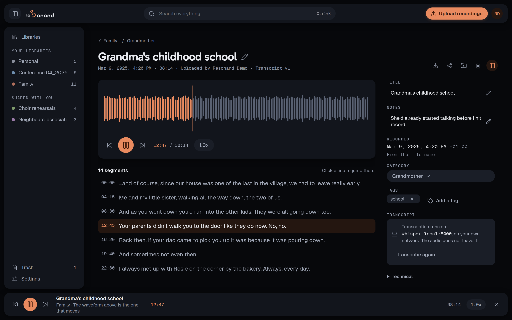
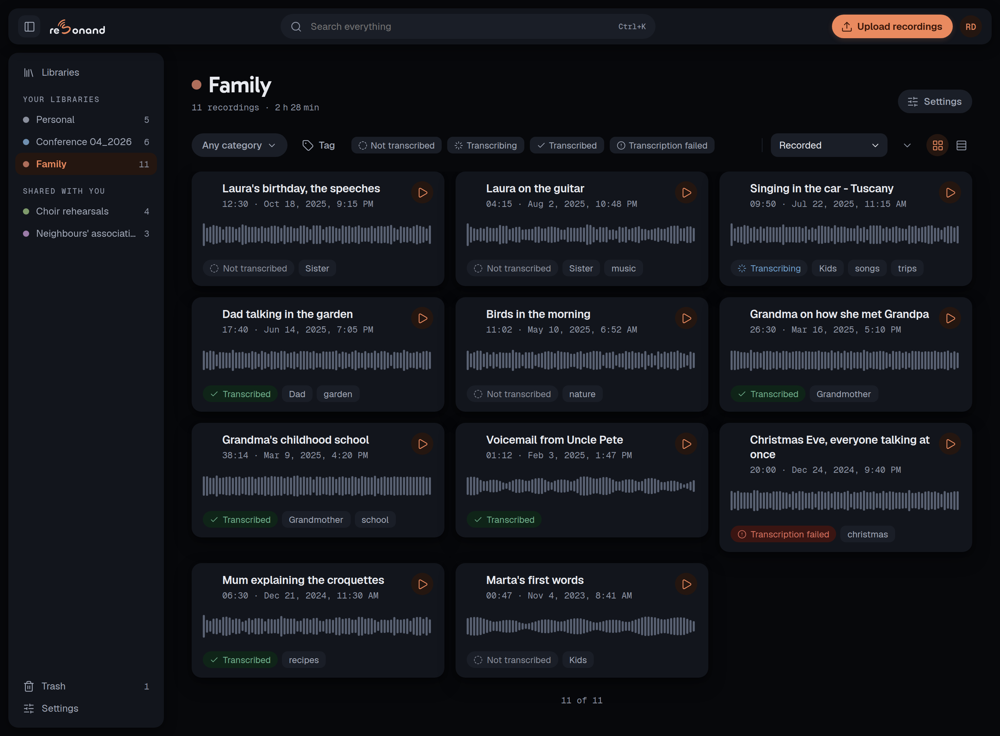
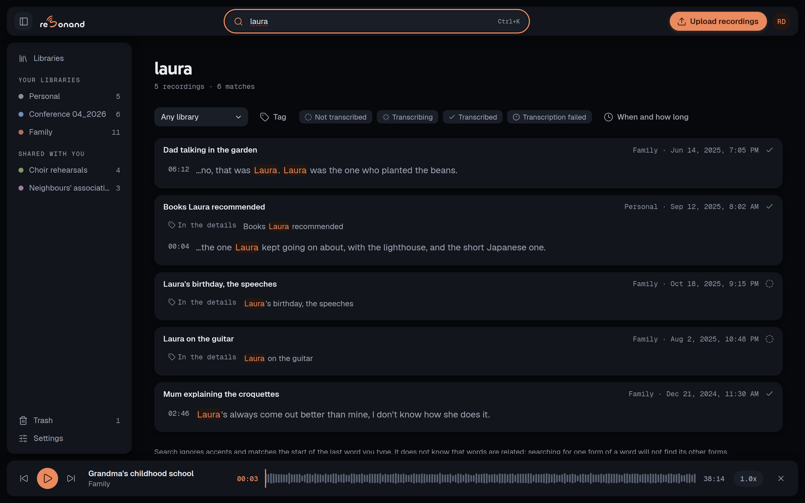
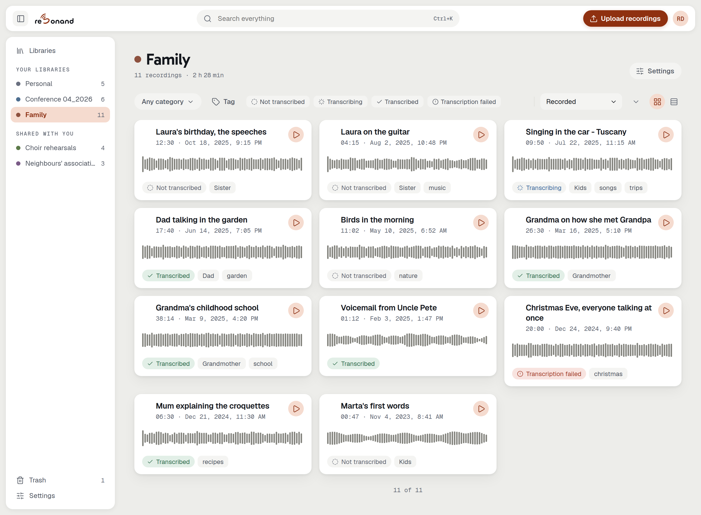

<p align="center">
  
</p>

<p align="center">
  Organised your way, shared with the people it belongs to,<br>
  and searchable inside everything you have ever recorded.
</p>

<p align="center">
  <a href="LICENSE"></a>
  <a href="https://github.com/resonand-app/resonand/pkgs/container/resonand"></a>
</p>

<p align="center">
  
</p>

---

> ### Status: `0.1.0` is out, and it is the first one.
>
> `ghcr.io/resonand-app/resonand:0.1.0`, for `linux/amd64` and `linux/arm64`.
> [`deploy/`](deploy/README.md) is a compose file, an `.env` and a volume.
>
> It was used before it was offered: a real archive imported, transcribed and searched; a second
> person on a shared library; a restore performed on real hardware rather than only in CI; and the
> whole archive exported and read back into an empty instance. Every screenshot here is a running
> instance rather than a mockup.
>
> It is still a first release, and the honest version of that is: one person has relied on it, on
> one kind of hardware. [`CHANGELOG.md`](CHANGELOG.md) says what the number promises, and
> [`SECURITY.md`](SECURITY.md) says what is known to be thin.

## The problem

The recordings that matter most are the ones with no second copy. Your child's first words,
a long conversation with your father, a song your grandmother used to sing — and just as much
the interview you will have to cite, a whole course of lectures, or the ideas you dictated in
the car.

They deserve a place of their own, organised the way you organise things, on hardware you
control. What they usually get is a folder, and an audio file you cannot skim is an audio file
nobody ever opens again.

## What it does

Most self-hosted tools in this space are transcribers that happen to store files. resonand is an
archive that happens to transcribe.

- 🔎 **Search inside the audio.** One query across every transcript in your archive, not inside
  one file at a time. Every result carries a timestamp and plays from that exact second.
- 🗂️ **Organisation that persists.** Libraries, a category tree and cross-cutting tags. Built for
  hundreds of hours, not for one work session.
- 👥 **Multi-user from the ground up.** Real accounts for the people you share an archive with,
  and sharing at library level, with permissions resolved on every single read.
- 🔒 **Your audio stays on your hardware.** It leaves the instance only when you ask for a
  transcription, and the interface tells you where it is going before it does. Point it at a
  transcription server on your own network and it never leaves at all.
- 🧾 **Transcripts as segments.** Always timestamped segments, never a wall of text — that is what
  lets the transcript follow along as it plays, and a click on any line jump there.
- 📦 **The original, untouched.** The file you ingested is kept byte-for-byte, never re-encoded and
  never rewritten, and it can be checked against its hash at any time. A compressed copy is
  derived separately, for the browser.
- 📤 **Complete export.** One command dumps audio, metadata and transcripts in a format that does
  not need this software to read.
- 🔁 **Engine independence.** Change transcription endpoint or model without losing a single
  transcript.
- 🔌 **Programmatic access.** A documented HTTP API, with the web interface as just another client
  of it.

## What it looks like

The waveform is computed once, from the recording itself, and is never invented.

- **A library.** Every card carries its duration, when it was recorded, what its transcription is
  doing and the tags you gave it — and a waveform drawn from the audio itself.
  
- **Searching every transcript at once.** Each match comes with the moment it was said.
  
- **Light, if you prefer it.** Dark is the default and light is the same set of tokens redefined —
  one stylesheet, not two, and every colour comes from it.
  

## What it is not

Not an audio editor, not a podcast player, not a music library manager.

**It does not transcribe.** It sends a recording, when you ask, to a transcription endpoint you
choose — a server on your own network or a hosted service — and keeps what comes back. That is a
deliberate architecture decision, not a missing feature: the engine is replaceable, and changing
it has to lose nothing.

## Transcription

resonand works with any transcription endpoint that speaks the OpenAI-compatible shape and
returns timed segments: a faster-whisper server on your own network is the reference
deployment, and hosted services such as Groq work too. There is no list of supported models,
because compatibility depends on the endpoint and the model together, so instead there is a
check that answers before any of your recordings is sent: `resonand check-transcription`.
Beware of OpenAI's newer `gpt-4o-transcribe` models, which return text without segments and
are refused. The exact criteria, what has been verified and what is known not to work are in
[`deploy/transcription.md`](deploy/transcription.md).

## Running it

Python 3.12 + FastAPI · SQLite with FTS5 · React + TypeScript + Vite · one container, configured
entirely through environment variables. An instance is three things: the image, a volume at
`/data` holding the database and the original files, and an `.env` — plus a transcription endpoint
that passes `resonand check-transcription`. It migrates its own database on the way up.

```bash
docker pull ghcr.io/resonand-app/resonand:0.1.0
```

[`deploy/`](deploy/README.md) describes the arrangement — the compose file, how much the volume
needs, both reverse-proxy layouts, and what a backup has to cover. The image publishes
`linux/amd64` and `linux/arm64` under one name, so the same line works on a server and on a
Raspberry Pi.

## What comes next

[`ROADMAP.md`](ROADMAP.md) is the whole of it, written in the words somebody would use to ask for
a feature. The parts most likely to arrive first:

- 🎙️ **More transcription engines.** Engines with their own APIs beside the OpenAI-compatible
  shape, and more than one transcriber per instance — perhaps one per language, chosen per
  recording or per library.
- ✏️ **Editing what came back.** A correction creates a new transcript derived from the original,
  which is always kept: the archive no more overwrites what a machine produced than it overwrites
  a recording.
- 🤝 **Sharing a single recording**, and the "shared with me" destination such a recording is
  reachable from. The permission model already resolves individual grants; the interface has never
  offered one.
- 🔑 **OIDC, proxy-header authentication and personal access tokens.** Local accounts created by
  hand are the whole of the first version.
- 🤖 **An MCP server**, over HTTP with a token, so an assistant can search your archive — text and
  metadata, never raw audio.
- ⏺️ **Recording into the archive itself**, from the browser and from a mobile application. Today
  resonand is where recordings end up rather than where they are made; capture becomes one more
  thing it offers once the archive underneath is worth keeping things in.
- 📱 **Real PWA quality on a phone**, and somewhere to try the thing without installing anything.

It also says what will **not** happen, which is the more useful half: no audio editing, no podcast
player, no music library manager, and no transcription engine inside the application.

## Documentation

| Document | Contents |
|---|---|
| [`VISION.md`](VISION.md) | Why it exists, who it is for, the principles it will not break, and how it will be sustained |
| [`ROADMAP.md`](ROADMAP.md) | What comes after the first version, and what is explicitly out of scope |
| [`docs/v0.1.0-plan/`](docs/v0.1.0-plan/) | The build plan for the first version, one file per work track |
| [`docs/next-plan/`](docs/next-plan/) | What is scoped and waiting for a version to claim it |
| [`deploy/`](deploy/README.md) | What an operator needs: the first account, the volume, the `.env`, the proxy, backups, and which transcription endpoints work |
| [`frontend/design-system/`](frontend/design-system/README.md) | The interface's visual language: tokens, components, the mark and the specimen cards |
| [`CHANGELOG.md`](CHANGELOG.md) | What each release changed, and what the version number promises |
| [`API.md`](API.md) | The HTTP API: how a script signs in, the conventions, and what is worth automating |
| [`SECURITY.md`](SECURITY.md) | How to report a vulnerability, what resonand assumes, and the limitations it knows about |
| [`CONTRIBUTING.md`](CONTRIBUTING.md) | What is welcome, what to open an issue about first, and how a pull request is read |

## Contributing

**Issues, security reports and code are all welcome.** Code opened with `0.1.0`, after the first
version had been used in private long enough to be worth offering.
[`CONTRIBUTING.md`](CONTRIBUTING.md) is the whole of it, including the one request: open an issue
before a large change, so that nobody spends a weekend on something that disagrees with
[`VISION.md`](VISION.md).

Two are worth opening whatever else you do. A **security report**, through the private channel
described in [`SECURITY.md`](SECURITY.md) — a way into somebody else's recordings is the report
this project most wants. And a **disagreement with something in [`VISION.md`](VISION.md)**, which
is cheap to change now and expensive later.

## Licence

Copyright (C) 2026 sirwilliamdev.

[AGPL-3.0](LICENSE), with no CLA. You can run it, modify it and host it; if you host a modified
version for others, you publish your changes. There will never be a feature reserved for paying
users — see [`VISION.md`](VISION.md#7-licence-governance-and-sustainability).
