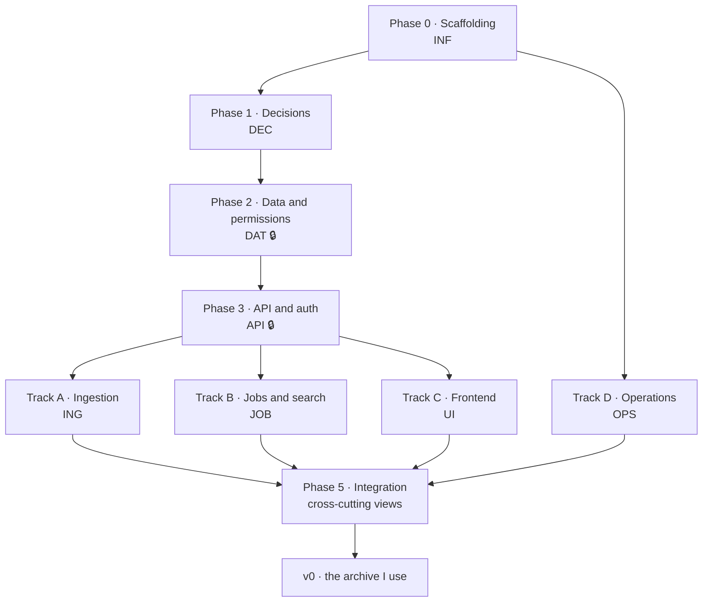

# v0 — the archive I use

The build plan for the **first version**, which has one job: to replace what I currently do with
my own audio. Publishing is not part of this milestone. Everything that comes after it lives in
[`ROADMAP.md`](../ROADMAP.md).

### The utility threshold

> I can put audio in, it gets transcribed, and I find one specific moment by searching across
> everything I have.

Anything that does not serve that sentence directly is not v0. Chasing summaries and AI features
in the first version would mean competing on ground that is already lost.

### The rule that governs this milestone

**Do not publish until it has run against the real archive for several months.** In this niche
credibility comes exclusively from the author using the tool, and the fastest way to destroy it is
to ship something that loses files. The repository stays private until the milestone in
[`ROADMAP.md`](../ROADMAP.md) is met (`DEC-7`).

### What is cut, and what is not

The **data model stays whole** — rebuilding it later is far more expensive than carrying columns
nobody reads yet. Permission resolution stays exactly as specified, because it is cheap and it is
the foundation everything else stands on.

What is cut is surface: v0 ships with **local accounts only**, users created by hand by the
administrator, and **sharing at library level only**. Left out: OIDC, proxy-header authentication,
individual-recording sharing, ownership transfer (users with content simply cannot be deleted),
API tokens, MCP, manual transcript editing and LLM suggestions. Every one of those keeps its task
identifier and is listed in [`ROADMAP.md`](../ROADMAP.md).

---

## How to read this document

Every task has a **stable identifier** (`DAT-3`, `UI-7`…) that can be referenced from commits,
branches and issues. The prefix indicates the **work track**, not the phase. **Identifiers never
get renumbered** — a task deferred to `ROADMAP.md` keeps the number it has here.

| Prefix | Track | What it covers |
|---|---|---|
| `INF` | Repository infrastructure | Scaffolding, tooling, CI |
| `DEC` | Decisions | Open points that block code |
| `DAT` | Data and permissions | Schema, migrations, ACL, access layer |
| `API` | API and authentication | HTTP skeleton, sessions |
| `ING` | Ingestion and playback | Storage, ffprobe, waveform, streaming, integrity |
| `JOB` | Jobs, transcription and search | Queue, providers, segments, FTS5 |
| `UI` | Frontend | Every view in the interface brief |
| `OPS` | Operations | Docker, configuration, backup, observability |
| `INT` | Integration | Views that cross tracks: trash, administration, security |

Notation:

- `⇢ X, Y` — **depends on**. Cannot start until `X` and `Y` are done.
- `🔒` — **critical path**: until it is done, entire tracks are stalled.
- `🧪` — carries a mandatory test before it can be called done.
- `❓` — depends on a decision that is still open.

A task is done when it meets the criterion written next to it, not when it "works".

The schema, the permission query and the per-view interface brief that several tasks below refer
to live in a working specification kept out of this repository while the first version is being
built. Everything needed to understand *what* a task is and *why* it exists is here.

---

## Decisions already made

| Topic | Decision | Consequence |
|---|---|---|
| Backend | Python 3.12 + FastAPI | First-class MCP SDK, `ffmpeg`/`ffprobe` are comfortable, home language |
| Database | SQLite + FTS5, migrations with Alembic | A single file, trivial backup |
| Frontend | React + TypeScript + Vite (SPA) | The persistent player forces an SPA |
| Licence | AGPL-3.0, no CLA | Nobody can offer a closed SaaS out of it without publishing their changes |
| Topology | **A single container**, in-process job worker | WAL + a single serialised writer. Can be split later without touching the schema |
| UI language | English as the base language, i18n from day one | No literal written inside a component. Shipping actual translations is a later milestone |
| Repository | `sonarium-app/sonarium`, private until publishable | The `sonarium-app` organisation is reserved and empty |

These are documented as ADRs in `docs/adr/` (`INF-8`) so they can be revisited together with
their rationale, not from memory.

---

## Phase map



**How much parallelism there actually is**, by point in the project:

| Point | Work that can run in parallel… |
|---|---|
| Phases 0–1 | `INF` and `DEC` at the same time; `OPS-1`/`OPS-2` can already be tackled |
| Phase 2 | Not much else: `DAT` is the bottleneck. In parallel: `UI-1`, `UI-2` (tokens and waveform, without real data), and `JOB-13`, which needs no schema |
| Phase 3 | `API` alongside `UI-3`/`UI-4` (client and shell against mocks) and `OPS` |
| Phase 4 | **Four full tracks at once**: `ING`, `JOB`, `UI`, `OPS` |
| Phase 5 | Everything converges; the cross-cutting tasks want two finished tracks |

---

## Phase 0 · Repository scaffolding

Short and mechanical, but it conditions everything that comes after. No product code.

- [ ] **INF-1** · Monorepo structure.
      ```
      backend/sonarium/{api,core,db,acl,media,jobs,transcription,mcp,cli}/
      backend/tests/
      frontend/src/{app,components,features,lib,i18n}/
      deploy/            docs/            scripts/
      ```
      *Done when:* `backend/` and `frontend/` install and start up empty, each with its own "hello".

- [ ] **INF-2** · Python tooling: `uv` for dependencies and environment, `ruff` (lint + format),
      `mypy` in strict mode, `pytest` + `pytest-cov`. ⇢ INF-1

- [ ] **INF-3** · Frontend tooling: Vite + React + strict TS, ESLint, Prettier, Vitest,
      Testing Library. ⇢ INF-1

- [ ] **INF-4** · `pre-commit` with both toolchains, failing identically locally and in CI. ⇢ INF-2, INF-3

- [ ] **INF-5** · CI on GitHub Actions: lint + typecheck + tests on both sides, plus a build of the
      Docker image. ⇢ INF-4

- [ ] **INF-6** ❓ · **Create the remote repository and attach it**, private, under the reserved
      organisation. The organisation exists and is empty; the repository does not exist yet.
      ⇢ DEC-7
      ```fish
      gh repo create sonarium-app/sonarium --private --source . --remote origin
      git push -u origin main
      ```
      Careful: git operations must go through the `github.com-personal` SSH alias (key
      `id_rsa_personal`), not `github.com`.

- [ ] **INF-8** · `docs/adr/` with the decisions already made, one per file, with the discarded
      alternatives and the rationale.

---

## Phase 1 · Decisions that block code

Each one ends in an ADR in `docs/adr/`. They can all be resolved in parallel. Two of them block
the first migration, and writing a migration that later has to be undone is the worst place to get
it wrong.

- [ ] **DEC-1** 🔒 · **Automatic category suggestion.** `audio_tag.source = 'llm'` already
      distinguishes a suggested tag from a confirmed one; for the category there is no equivalent.
      Options: `suggested_category_id` on `audio`, or a generic `suggestion` table
      (`entity`, `entity_id`, `kind`, `value`, `confidence`, `confirmed_at`).
      *Recommendation:* the generic table — the same mechanism will serve for title and recording
      date, which is where this ends up going.
      **Blocks `DAT-1`**: either it goes into the first migration or it does not. The feature that
      fills the table is out of v0; the table is not.

- [ ] **DEC-3** · **Trash retention**: the default value and whether it is configurable per
      instance or per library. *Recommendation:* 30 days, configurable per instance.
      **Blocks `INT-1`/`INT-2`, not the migration** (`deleted_at` is already there).

- [ ] **DEC-4** · **Grouping of search results** when an audio has several matches: grouped under
      the audio, or listed flat. *Recommendation:* grouped, with the first 3 matches visible and
      a "+N more" that expands. It conditions the shape of the `JOB-10` response and the design of
      `UI-16`.

- [ ] **DEC-5** · **Export sidecar format**, which is principle 1: JSON with metadata + the full
      transcript, plus derived `.vtt`/`.srt`. It must be re-importable by `ING-11`.
      *Decided now because the sidecar is the central promise of the project.*

- [ ] **DEC-7** 🔒 · **Final name variant, registered everywhere at once**: GitHub organisation and
      repository, domain, container image namespace, documentation. There is prior use of the term
      in the same semantic field (a sound designer and recording engineer working under this name,
      with a site and a presence on music platforms) and a discontinued mobile audio game. **The
      risk is accepted knowingly** — no meaningful trademark exposure, since a sound engineer's
      services and a piece of software are not the same class, but there is a discovery cost.
      The consequence that matters here: **the variant is decided once and claimed in every place
      simultaneously.** The worst outcome is starting with one and having to change it.
      **Blocks `INF-6`.**

- [ ] **DEC-8** 🔒 · **Colour and typographic direction**, one identity and not a palette switcher.
      The interface proposal carries four palettes; shipping all four is the opposite of having a
      visual identity, and it is one of the tells of an auto-generated design that the brief
      explicitly rejects. Choose one, keep the other three as the record of how the choice was
      made. **Blocks `UI-1`.**

- [ ] **DEC-9** · **Watch-folder transcription policy.** Principle 2 says audio leaves the instance
      only when the user asks, audio by audio. A watched folder that auto-transcribes on arrival is
      by definition not audio by audio. Either the principle keeps its standing-configuration
      clause and the folder's auto-transcription is opt-in per folder with the destination provider
      named in the configuration, or auto-transcription is not offered for watched folders at all.
      *Recommendation:* opt-in per folder, disabled by default, stated in the admin view.
      **Blocks `ING-9`, `UI-25`.**

---

## Phase 2 · Data and permissions core 🔒

**The bottleneck of the project.** Nothing that touches data can be written before it. The ACL
query is the only source of truth for permissions and everything goes through it.

- [ ] **DAT-1** 🔒 · Initial Alembic migration with the full schema, including whatever comes out of
      `DEC-1`. Partial indexes, the composite FK `(category_id, library_id)` and the `share`
      `CHECK` included — they do not get added "later". ⇢ DEC-1

- [ ] **DAT-2** 🔒 · Connection layer: `PRAGMA journal_mode=WAL`, `foreign_keys=ON`,
      `busy_timeout`, `synchronous=NORMAL`. **A single serialised writer** inside the process;
      concurrent reads free. ⇢ DAT-1
      🧪 Load test that fires N simultaneous writes and checks that none gets `SQLITE_BUSY`.

- [ ] **DAT-3** 🔒 · **The ACL CTE** as the single entry point to `audio`. No other part of the code
      queries `audio` directly. ⇢ DAT-2
      🧪 Exhaustive test matrix: owner, library share, individual share, both at once (the highest
      wins), deleted library, deleted audio, disabled user. **This test is the most important one
      in the repository.** Individual sharing has no interface in v0, but the resolution is tested
      from day one.

- [ ] **DAT-4** · Repositories/queries for `library`, `category`, `tag`, `transcript`, `segment`,
      all with the required ACL level as a mandatory parameter. ⇢ DAT-3

- [ ] **DAT-5** · User creation → creates the non-deletable `is_personal = 1` personal library,
      within the same transaction. ⇢ DAT-4
      🧪 There must be no path that creates a user without a personal library.

- [ ] **DAT-6** · Tag normalisation (`slug` lowercase and without diacritics) and **ACL-filtered**
      autocomplete — tag names must not leak information between accounts. ⇢ DAT-4 🧪

- [ ] **DAT-7** · Category tree with `parent_id`: creation, rename, reorder and move, with cycle
      detection and per-level uniqueness. ⇢ DAT-4 🧪

- [ ] **DAT-8** · Development fixtures and seed: users, libraries shared with all three levels, and
      audios with and without a transcript. Serves both the tests and, later, the demo. ⇢ DAT-5

---

## Phase 3 · API skeleton and authentication 🔒

From the end of this phase onwards the four parallel tracks open up.

- [ ] **API-1** 🔒 · FastAPI skeleton: configuration through environment variables, uniform errors
      (`type`/`title`/`detail`), pagination, and published OpenAPI. ⇢ DAT-3

- [ ] **API-2** 🔒 · Authentication dependency that resolves the user and injects the ACL level into
      every endpoint. **No endpoint checks permissions on its own.** ⇢ API-1, DAT-3 🧪

- [ ] **API-3** · Local accounts: login, cookie session (`HttpOnly`/`SameSite=Lax`), Argon2id
      hashing, password change, session revocation. Registration is admin-only in v0.
      ⇢ API-2 🧪

- [ ] **API-7** · Bootstrap: the first user created is an administrator, who then creates the rest
      by hand. ⇢ API-3

- [ ] **API-8** · CRUD endpoints for `library`, `category`, `tag` and `share`, with the correct
      levels (sharing requires 30). Library-level shares only in v0; the endpoint shape already
      accepts `audio_id`. ⇢ API-2, DAT-4 🧪

- [ ] **API-9** · CRUD endpoints for `audio` (metadata: title, notes, recording date, category,
      tags) at level 20. ⇢ API-8 🧪

---

## Phase 4 · Four parallel tracks

The four tracks only touch the `DAT` layer through `API-2`, so they can be developed
simultaneously without stepping on each other.

### Track A · Ingestion, storage and playback

- [ ] **ING-1** · Storage layout: `storage/<uuid[0:2]>/<uuid>/original.<ext>` with `derived.opus`
      next to it. The original stays **intact**, never rewritten. ⇢ API-1

- [ ] **ING-2** · Upload through the API: multipart with progress, configurable size limit, and
      resumption for large uploads (hours-long files). ⇢ ING-1, API-9 🧪

- [ ] **ING-3** · Streaming SHA-256 hash during ingestion and **duplicate detection**: it warns and
      offers to continue, it never blocks silently. Byte-identical files only — a re-encoded copy
      of the same recording has a different hash, and the interface must not imply otherwise.
      ⇢ ING-2 🧪

- [ ] **ING-4** · `ffprobe` → `duration_ms`, `sample_rate`, `channels`, `codec`, `mime`,
      `size_bytes`. Run as a job, not inline with the request. ⇢ ING-2, JOB-1

- [ ] **ING-5** · Waveform peak computation, stored in `audio.waveform` (compact BLOB, not JSON).
      It is the product's "thumbnail". ⇢ ING-4 🧪

- [ ] **ING-6** · Transcoding to Opus into `derived_path` for browser playback. ⇢ ING-4

- [ ] **ING-7** · **Authenticated streaming with `Range` (HTTP 206).** `<audio>` cannot send
      headers: session cookie or a short-lived signed token in the URL. ⇢ ING-6, API-3 🧪
      🧪 Seeking has to work for real: test partial and overlapping `Range` requests.

- [ ] **ING-8** · Download of the original with its original filename. ⇢ ING-7

- [ ] **ING-9** ❓ · *Watch folder*: watching a directory, automatic ingestion into a configured
      library and category, and moving the file to `processed/` or `failed/`. For voice notes this
      ends up being the main entry path. Auto-transcription behaviour per `DEC-9`.
      ⇢ ING-3, JOB-1, DEC-9

- [ ] **ING-10** · Moving an audio between libraries: clears the category, changes who can see it,
      and **preserves the individual `share` rows**. Single transaction. The preservation clause has
      no visible effect in v0 and is implemented anyway, because retrofitting it is a data-loss bug.
      ⇢ API-9 🧪

- [ ] **ING-11** · CLI `sonarium import` (bulk, recursive, with `--dry-run`) and `sonarium export`
      (audio + the `DEC-5` sidecar, re-importable). ⇢ ING-3, DEC-5 🧪
      *This is principle 1. It ships in v0 even though nobody else will use it, because it is the
      promise the whole argument rests on and because adding it later always gets postponed.*

- [ ] **ING-12** · **Deriving `recorded_at`.** Recording date ≠ upload date, and nothing else
      populates it: `ffprobe` only returns technical metadata. Extract from, in order, container
      creation tags, the filename (`Recording 2024-03-11 18.22.m4a`, `PTT-20240311-WA0007.opus`,
      `AUD-20240311-…`), and filesystem mtime — recording which source was used, and leaving the
      field editable. ⇢ ING-4 🧪
      *Without this, every `recorded_at` in an imported archive of old voice notes is `NULL`, and
      the field, the sort order and the card decoration are all useless on day one.*

- [ ] **ING-13** · **`sonarium fsck`**: re-hash the stored originals against `audio.sha256`, report
      rows whose file is missing and files no row points at, and exit non-zero on any finding.
      Read-only; repairs are a separate explicit command. ⇢ ING-3, ING-11 🧪
      *This is principle 5 made checkable. The stated worst outcome for the project is shipping
      something that loses files; nothing else in the plan would notice if it did.*

### Track B · Job queue, transcription and search

- [ ] **JOB-1** 🔒 · In-process job worker: states `pending/running/done/failed/cancelled`, retries
      with exponential backoff, `idempotency_key`, and recovery of jobs left `running` across a
      restart. ⇢ API-1, DAT-2 🧪

- [ ] **JOB-2** · Transcription provider interface (**asynchronous** contract, never a synchronous
      call) and a provider registry driven by configuration. Carries **per-instance credentials and
      usage metering** — audio-seconds submitted, per user, per provider — from the first
      implementation. ⇢ JOB-1
      *The provider interface is a future revenue surface, not an architecture detail. It does not
      get simplified to save work, and a credit-based service without metering is a rewrite.*

- [ ] **JOB-3** · OpenAI-compatible `/v1/audio/transcriptions` provider. ⇢ JOB-2, JOB-13 🧪

- [ ] **JOB-6** · Transcript model: **always segments** with `start_ms`/`end_ms` and a `speaker`
      field present even if diarisation is not implemented. Plain text, subtitles and synchronised
      highlighting are derived from the segments; never the other way round. ⇢ JOB-2, DAT-4 🧪

- [ ] **JOB-7** · Several transcripts per audio: re-transcribing creates a new row, only one has
      `is_active = 1`, and switching the active one is atomic. ⇢ JOB-6 🧪

- [ ] **JOB-9** · FTS5 index: synchronisation of `segment` → `segment_fts` (triggers or explicit
      writes, but one of the two and documented), and a `sonarium reindex` command. ⇢ JOB-6 🧪

- [ ] **JOB-10** · Search endpoint with the ACL applied inside the query, `snippet()` for the
      highlighted fragment, and whatever grouping format `DEC-4` decides. ⇢ JOB-9, DEC-4, DAT-3 🧪
      🧪 Test that a user does **not** find transcript text they are not allowed to see.

- [ ] **JOB-11** · Search filters: library, date range, duration range, tags, and transcription
      status. ⇢ JOB-10

- [ ] **JOB-13** 🔒 · **Chunking long audio, and re-stitching the timestamps.** The
      OpenAI-compatible endpoint caps requests at 25 MB, and compatible local servers impose their
      own memory and timeout ceilings; the anchor use case is a forty-minute interview and the
      daily one is an hour of driving. Split on silence with an overlap, submit the parts, and
      **offset every returned segment by its part's start**, de-duplicating the overlap.
      ⇢ JOB-2 🧪
      🧪 A synthetic three-hour file must come back as one continuous transcript whose segment
      timestamps still line up with playback at the end of the file, not only at the start.
      *Without this, v0 fails on exactly the recordings that motivated the project.*

- [ ] **JOB-14** · **Search recall decision and implementation.** `unicode61 remove_diacritics 2`
      gives accent-insensitivity but no stemming: *factory* will not find *factories*, and in
      Catalan and Spanish the inflected forms are where most queries land. Options: append a prefix
      wildcard to the trailing query token, add a secondary FTS5 `trigram` index for substring
      matching, or accept the limitation and document it. ⇢ JOB-10 🧪
      🧪 A recall fixture of real inflected queries against a real transcript, so the chosen
      behaviour is measured rather than assumed.
      *The whole promise is a three-second search. This is a decision to take, not to discover.*

### Track C · Frontend

`UI-1`/`UI-2` can start during Phase 2, and `UI-3`/`UI-4` against mocks during Phase 3.

- [ ] **UI-1** ❓ · Design system for the direction chosen in `DEC-8`: colour tokens, light and dark
      mode, typographic scale (Instrument Serif / Instrument Sans / IBM Plex Mono), spacing and
      radii. **No colour hand-written in a component.** ⇢ DEC-8

- [ ] **UI-2** · **Waveform component** — the product's signature visual element: bar and stroke
      variants, card / list / large player sizes, played vs pending state, and click to seek.
      ⇢ UI-1

- [ ] **UI-3** · API client generated from the OpenAPI spec (`openapi-typescript`), with shared
      types. ⇢ API-1
      *This is what keeps the interface a client of the API rather than a privileged path into it.*

- [ ] **UI-4** · Navigation shell: header with global search, sidebar with libraries and shared
      libraries, and mobile collapse. ⇢ UI-1, UI-3

- [ ] **UI-5** · **Persistent player**: it survives view changes, and a decision on whether the
      large player and the compact one are the same component in two states or two synchronised
      components (*recommendation: a single global state, two presentations*). Integration with the
      **Media Session API** for system controls on mobile. ⇢ UI-2, UI-4

- [ ] **UI-6** · **View A · Library grid**: header with owner, shares, count and total duration;
      audio card with the **four transcription states visually distinguishable**, category, tags
      with overflow, and a play button on the card. ⇢ UI-5, API-9

- [ ] **UI-7** · **View A' · Dense compact list** — for 800 audios the grid is useless. Fixed-height
      row, virtualised. ⇢ UI-6

- [ ] **UI-8** · Filters and sorting: category tree, tags as pills, transcription status toggles,
      and sorting by recording date / upload date / duration / title. ⇢ UI-6, DAT-6, DAT-7, ING-12

- [ ] **UI-9** · Multiple selection and bulk actions: assign category, add tag, move between
      libraries, send to trash. ⇢ UI-7

- [ ] **UI-10** · Grid states: empty (an invitation to upload, not a sad drawing), loading
      (skeletons), and error. ⇢ UI-6

- [ ] **UI-11** · **View B · Detail** with a large player and a seekable waveform, 0.75×–2× speed
      and ±15 s skips. ⇢ UI-5, ING-7

- [ ] **UI-12** · **Synchronised transcript** — the central moment of the product: the active
      segment is highlighted as it plays, clicking a segment seeks to that moment, and the scroll
      follows playback without hijacking the user's manual scrolling. ⇢ UI-11, JOB-6

- [ ] **UI-13** · Metadata panel, inline-editable according to permission, technical metadata
      collapsed, and a **read-only state that clearly reads as non-editable without looking
      broken**. ⇢ UI-11, API-9

- [ ] **UI-14** · Transcript selector when there is more than one (model, language, date, which one
      is active). `JOB-7` makes re-transcription possible, so without this it is unreachable from
      the interface. The manual editor is a later milestone. ⇢ UI-13, JOB-7

- [ ] **UI-15** · Transcription states in the detail view: missing (with a call to action), in
      progress (with progress if the provider offers it), and **failed with the real error message
      and a retry button** — the error explains what happened and what to do, it does not
      apologise. ⇢ UI-13, JOB-2

- [ ] **UI-16** · **View C · Search**: transcript results with a context fragment, a timestamp, and
      playback from that exact point **without opening the detail view**. Grouping according to
      `DEC-4`. ⇢ UI-5, JOB-10

- [ ] **UI-17** · **View D · Library and sharing**: edit name and description, manage the category
      tree, a panel with who has access, at what level, who granted it and when, and the level
      selector **explained in plain language**. Library-level grants only in v0. ⇢ UI-4, API-8

- [ ] **UI-18** · **View E · Upload dialog**: drag and drop, multiple files, per-file progress,
      destination (library + category), the transcription request from `UI-25`, handling of hash
      duplicates and unsupported formats, and **an upload that is not lost when switching tabs**.
      ⇢ UI-4, ING-2, ING-3, UI-25

- [ ] **UI-19** · **View F · Move audio dialog** — its own design, because it has non-obvious
      consequences. It must explicitly warn that it will change who can see the audio and that the
      category will be lost. ⇢ UI-13, ING-10

- [ ] **UI-20** · **View G · Profile**: name, email, avatar, language, theme, password change and
      active sessions. Tokens are not in v0. ⇢ UI-4, API-3

- [ ] **UI-21** · **View J · Authentication**: local sign-in, and the first-run screen that creates
      the initial administrator. ⇢ API-3, API-7

- [ ] **UI-22** · i18n plumbing: English as the base, **every literal externalised**, localised date
      and duration formatting. Shipping actual translations is a later milestone; making them
      possible without touching components is v0. ⇢ UI-4

- [ ] **UI-23** · Accessibility as the floor: visible keyboard focus, `prefers-reduced-motion`
      respected, AA contrast, full keyboard navigation of the player and the transcript.
      ⇢ UI-12 🧪 axe audit on every view.

- [ ] **UI-24** · A real mobile-first pass: much of the consumption happens on a phone, with
      headphones, on the move. Gestures, touch target sizes, and the player coexisting with the
      system controls. PWA installability and offline behaviour are a later milestone. ⇢ UI-23

- [ ] **UI-25** ❓ · **External transcription disclosure** — principle 2 made visible. Wherever a
      transcription is requested, the interface names **which provider the audio will be sent to**
      and that it will leave the instance, before the request is made; the standing-configuration
      case from `DEC-9` says the same thing in the admin view where it is enabled. No silent egress
      anywhere, including the retry path. ⇢ UI-13, JOB-2, DEC-9 🧪
      *This is the one principle with no other implementing task. Without it, principle 2 is a
      sentence in a document rather than a property of the software.*

### Track D · Operations and deployment

- [ ] **OPS-1** · Multi-stage `Dockerfile`: frontend build, backend with `ffmpeg`, final image
      without the toolchain, non-root user. ⇢ INF-1

- [ ] **OPS-2** · Example `docker-compose.yml` with volumes for the database and the storage, plus a
      documented `.env.example`. ⇢ OPS-1

- [ ] **OPS-3** · Configuration **through environment variables only**, validated at startup with
      useful messages (not a stack trace). ⇢ API-1

- [ ] **OPS-4** · **Subdomain and subpath** support (`/sonarium`), both tested behind a reverse
      proxy. In v0 because retrofitting a base path into an SPA is genuinely painful, and the
      subpath is the one that always ends up broken. ⇢ OPS-2, UI-4 🧪

- [ ] **OPS-5** · `/healthz` and `/readyz`, and structured logs with request correlation. ⇢ API-1

- [ ] **OPS-7** · Automatic migrations at startup with locking, and a documented rollback path.
      ⇢ DAT-1, OPS-1

- [ ] **OPS-6** · **Backup and restore that are actually exercised.** A consistent copy of the
      SQLite database in WAL mode (`VACUUM INTO`) without stopping the service, plus what to copy
      from `storage/`. ⇢ OPS-2 🧪
      🧪 Restore into a clean container and assert the archive is complete, and upgrade a populated
      database from the previous migration revision and assert nothing was lost. Formal
      cross-version documentation is a later milestone; during v0 I am upgrading my own real
      archive continuously, which is when these break.

---

## Phase 5 · Integration and cross-cutting views

Everything that needs two finished tracks at once.

- [ ] **INT-1** · **View I · Trash**: deleted audios and libraries with the time they have left,
      restore and delete now. Permanent deletion requires **typed confirmation**.
      ⇢ UI-9, DEC-3, API-8 🧪

- [ ] **INT-2** · Scheduled trash purge according to `DEC-3`, as a recurring job, also deleting the
      files from `storage/`. ⇢ INT-1, JOB-1 🧪

- [ ] **INT-3** · **View H · Administration**, visually separated so nobody wanders into it by
      accident: users (list, create, disable — **deleting a user with content is refused in v0**,
      with a message saying why), transcription provider (configuration, connection test, status),
      job queue (pending, running, failed, retry, cancel), and system status (space used, audio
      count, index size). ⇢ UI-20, API-7, JOB-1

- [ ] **INT-5** · Security pass: signed URLs, size limits, login rate limiting, and verification
      that **no endpoint has escaped `API-2`**. ⇢ every track 🧪
      🧪 Test that enumerates every route and fails if any of them skips the ACL.

- [ ] **INT-6** · End-to-end tests (Playwright) of the paths that matter: upload → transcribe →
      search → play from the result; share a library → the other user sees it at the correct level;
      move between libraries → who can see it changes. ⇢ INT-5

---

## When is v0 done

Not when the checkboxes are ticked. When all of these hold:

1. **My real archive is in it** — imported, transcribed, searchable — and I have stopped using
   what I used before.
2. **A second real person uses it.** One family member, one shared library, actual usage on a
   phone. The retention layer is what justifies the entire multi-user architecture, and until
   somebody who did not build it uses it, that justification is theoretical and the permission
   model is validated only by its own tests.
3. **`ING-13` has run clean** against the real archive after at least one upgrade, and
   **`OPS-6`'s restore has been performed for real**, not just tested in CI.
4. **`ING-11`'s export round-trips**: export the whole archive, import it into an empty instance,
   and get the same thing back.
5. **Several months have passed** with all of the above true.

Only then does the milestone in [`ROADMAP.md`](../ROADMAP.md) begin.
