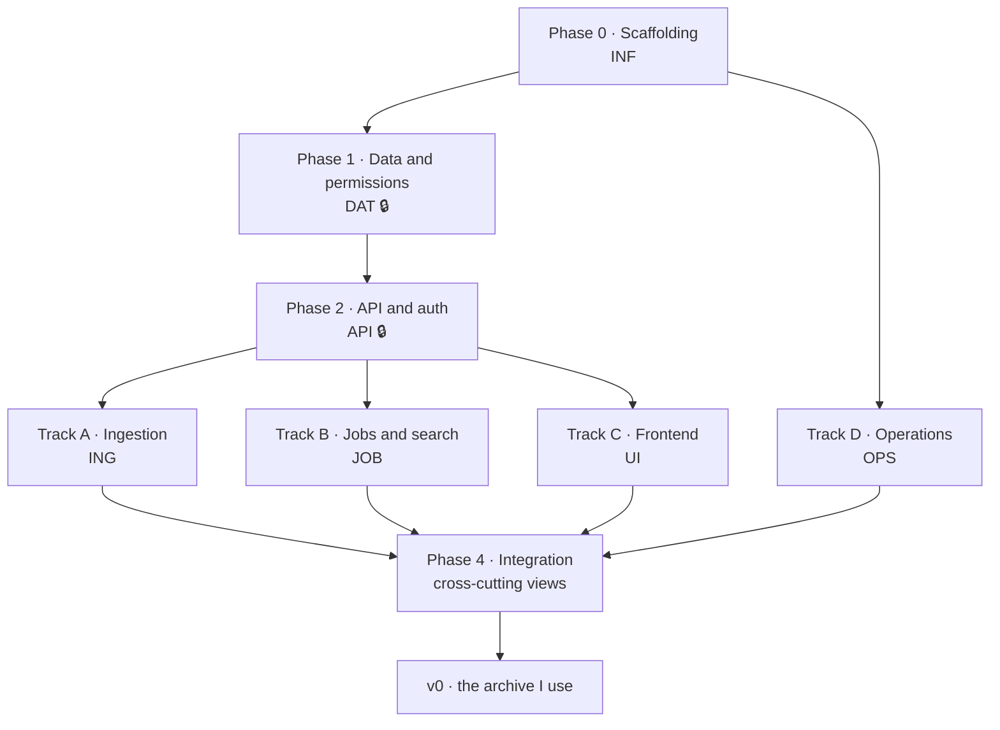

# v0 — the archive I use

The build plan for the **first version**, which has one job: to replace what I currently do with
my own audio. Publishing is not part of this milestone. Everything that comes after it lives in
[`ROADMAP.md`](../ROADMAP.md).

### The utility threshold

> I can put audio in, it gets transcribed, and I find one specific moment by searching across
> everything I have.

Anything that does not serve that sentence directly is not v0. Chasing summaries and AI features
in the first version would mean competing on ground that is already lost.

### The rule that governs this milestone

**Do not publish until it has run against the real archive for several months.** In this niche
credibility comes exclusively from the author using the tool, and the fastest way to destroy it is
to ship something that loses files. The repository stays private until the milestone in
[`ROADMAP.md`](../ROADMAP.md) is met; making it public is `REL-5`, at the end of that
milestone.

### What is cut, and what is not

The **data model stays whole** — rebuilding it later is far more expensive than carrying columns
nobody reads yet. Permission resolution stays exactly as specified, because it is cheap and it is
the foundation everything else stands on.

What is cut is surface: v0 ships with **local accounts only**, users created by hand by the
administrator, and **sharing at library level only**. Left out: OIDC, proxy-header authentication,
individual-recording sharing, ownership transfer (users with content simply cannot be deleted),
API tokens, MCP, manual transcript editing and LLM suggestions. Every one of those keeps its task
identifier and is listed in [`ROADMAP.md`](../ROADMAP.md).

---

## How to read this document

Every task has a **stable identifier** (`DAT-3`, `UI-7`…) that can be referenced from commits,
branches and issues. The prefix indicates the **work track**, not the phase. **Identifiers never
get renumbered** — a task deferred to `ROADMAP.md` keeps the number it has here.

| Prefix | Track | What it covers |
|---|---|---|
| `INF` | Repository infrastructure | Scaffolding, tooling, CI |
| `DEC` | Decisions | Open points that block code |
| `DAT` | Data and permissions | Schema, migrations, ACL, access layer |
| `API` | API and authentication | HTTP skeleton, sessions |
| `ING` | Ingestion and playback | Storage, ffprobe, waveform, streaming, integrity |
| `JOB` | Jobs, transcription and search | Queue, providers, segments, FTS5 |
| `UI` | Frontend | Every view in the interface specification |
| `OPS` | Operations | Docker, configuration, backup, observability |
| `INT` | Integration | Views that cross tracks: trash, administration, security |

Notation:

- `⇢ X, Y` — **depends on**. Cannot start until `X` and `Y` are done.
- `🔒` — **critical path**: until it is done, entire tracks are stalled.
- `🧪` — carries a mandatory test before it can be called done.
- `❓` — depends on a decision that is still open. **Nothing in this document carries it any
  more**; every decision the first version needs is settled below.

A task is done when it meets the criterion written next to it, not when it "works".

The schema, the permission query and the per-view interface specification that several tasks below
refer to live in working documents kept out of this repository while the first version is being
built. The one exception is the **design system**, which is vendored at `frontend/design-system/`
because the application consumes it directly. Everything needed to understand *what* a task is and
*why* it exists is here.

---

## Decisions

All of them settled. Nothing in the first version is waiting on a conversation.

| Topic | Decision | Consequence |
|---|---|---|
| Backend | Python 3.12 + FastAPI | First-class MCP SDK, `ffmpeg`/`ffprobe` are comfortable, home language |
| Database | SQLite + FTS5, migrations with Alembic | A single file, trivial backup |
| Frontend | React + TypeScript + Vite (SPA) | The persistent player forces an SPA |
| Licence | AGPL-3.0, no CLA | Nobody can offer a closed SaaS out of it without publishing their changes |
| Topology | **A single container**, in-process job worker | WAL + a single serialised writer. Can be split later without touching the schema |
| UI language | English as the base language, i18n from day one | No literal written inside a component. Shipping actual translations is a later milestone |
| Name and repository | `sonarium`, at `sonarium-app/sonarium`, private until publishable | `DEC-7`. Created and empty; the same string is the image name and the docs namespace |
| Visual identity | The **Sonarium design system**, vendored at `frontend/design-system/` | `DEC-8`. Signed off and final; no palette switcher ships |
| Audio egress | Nothing leaves the instance without a request, and watched folders only when explicitly configured to | `DEC-9`. Principle 2 made operational |
| Suggestions | No suggestion storage in the first migration | `DEC-1`, deferred with the AI features it serves |
| Timestamps | Instants in UTC; a recording's own time as wall clock plus offset | `DEC-11`. Two kinds of value, never mixed |
| Sessions | A `session` table, opaque id in the cookie | `DEC-12`. Revocation and the active-sessions list become real |
| Search coverage | Transcripts **and** titles, notes and tags, in one ranked list | `DEC-13`. A second FTS5 table in the first migration |
| Addressing | `uuid` in URLs, integer ids internal, **404 for unreadable** | `DEC-14`. A 403 confirms the resource exists |
| Identity keys | Normalised email; first writer owns a tag's display name | `DEC-15`. Unique key and display form kept apart |
| Duplicates | Hash match includes the trash, and says so | `DEC-16` |
| Default title | Filename without extension, cleaned, editable | `DEC-16` |
| Accepted formats | Audio, plus video containers kept whole with audio derived | `DEC-17`. The mp4 is often the one that matters |
| Transcription | Local `faster-whisper` behind an OpenAI-compatible server | `DEC-18`. Language optional per request, `null` = auto-detect |
| Waveform | Mono `int8` min/max pairs, fixed rate, version byte | `DEC-19` |
| Trash retention | 30 days, configurable per instance | `DEC-3` |
| Search grouping | Grouped under the recording, 3 shown, "+N more" | `DEC-4` |
| Export sidecar | JSON + derived `.vtt`/`.srt`, carrying the `uuid` | `DEC-5`. Re-import is idempotent |

`INF-8` transcribes each one into `docs/adr/`, one file per decision, so they can be revisited
together with their rationale rather than from memory. The subsections below carry the substance
that a one-line table row cannot.

### The name, claimed once (DEC-7)

`sonarium`, under the `sonarium-app` organisation: repository, container image, documentation
namespace and domain all carry the same string. The repository exists and is private.

There is prior use of the term in the same semantic field — a sound designer and recording
engineer working under this name, with a site and a presence on music platforms, plus a
discontinued mobile audio game. **The risk is accepted knowingly.** It is not a meaningful
trademark exposure, since a sound engineer's services and a piece of software are not the same
class, but it is a real discovery cost: competition for the term inside the same sector.

### The design system (DEC-8)

**Settled, and the artefact is in the repository.** The system is vendored at
[`frontend/design-system/`](../frontend/design-system/README.md): tokens, components, the mark,
the Chillax webfont, seventeen specimen cards and a click-through app kit. Its `README.md` is the
system in prose and is the authority — what follows is only enough to know what was decided,
because a plan should not restate a stylesheet.

This **supersedes the *Archive* palette** — a warm neutral with an indigo ink accent, Instrument
Serif / Instrument Sans / IBM Plex Mono — and the interface proposal that carried it. Both have
been retired; neither is an input to anything. The direction was chosen from four built candidates
and the specimen boards are kept for the record under `docs/internal/design/provenance/`.

What it decides:

- **One chromatic family: amber.** `--amber-300…900`, 400 as the accent on dark and 700 on light,
  every step declaring the on-colour that clears AA against it. A played waveform, a primary
  button and an active nav item are visibly the same signal.
- **Two neutral ramps.** `--ink-*` (blue-black) for dark, `--paper-*` (warm) for light, aliased
  through semantic names that flip on `[data-theme="light"]`. **Dark is the default and light is a
  full peer** — a token redefinition, never a second stylesheet.
- **Three type families, three jobs.** *Chillax* 600 for the wordmark and the one page title per
  screen and nothing else, ever. *Geist* for the interface. *Geist Mono*, tabular, for anything
  comparable to another number — durations, timestamps, counts, speed.
- **Elevation, not borders.** Panels float in a 12px gap on three steps of shadow. No gradients,
  no textures, no glass, no imagery. The waveform is the only graphic the product owns and it is
  real data.
- **The waveform**, at five sizes exactly — 20 dense row, 38 library card, 52 recording card,
  34 player, 130 audio detail — as amplitude in rounded bars, minimum bar height equal to bar
  width so silence stays a row of dots rather than disappearing. Drawn from the peaks `ING-5`
  stores; **until that job has run there is no waveform**, only a dashed rule and a duration.
- **Library colour**, user-chosen from seven muted hues. It identifies a library and carries no
  meaning; it is never derived from the name or the audio. This is what `library.colour` in
  `DAT-1` exists for.
- **Lucide** at 1.7px stroke, on a 24px grid, as the icon set.

**No colour is hand-written in a component**, and no palette switcher ships: the user chooses
light, dark or follow-the-system, and nothing else.

Two things the system ships as compromises, both of which `UI-1` closes:

- **Geist is fetched from Google Fonts and Lucide from a CDN.** A self-hosted archive that phones
  out to render its own interface is the wrong shape, and it breaks in an air-gapped deployment.
  Both get bundled.
- **The icons are a substitution.** The specimen board's glyphs were drawn for the exploration and
  Lucide replaced them, so the system ships a complete maintained set rather than a partial
  hand-drawn one. `Icon` is the only file that changes if that is ever revisited.

Where anything *goes* is not this system's job. Navigation, routes and every view with its real
fields, states and actions are in the interface specification kept alongside the working
specification, out of this repository while the first version is being built.

### Watched folders and audio egress (DEC-9)

Principle 2 keeps its standing-configuration clause: a watched folder **may** request
transcription on arrival, but it is **opt-in per folder and disabled by default**, the
destination provider is named in the folder's configuration, and the administration view states
which folders send audio out and where. No folder transcribes because it happened to be created.

### What the first migration contains (DEC-8, DEC-11 to DEC-15)

`DAT-1` writes the schema from the specification **plus these seven deltas**, each of which exists
because something was promised elsewhere with no storage behind it. They are listed together
because this is the artefact `DAT-1` needs, and because every one of them is expensive to add
afterwards.

1. **`session` table** (`DEC-12`) — `id`, `user_id`, `token_hash`, `created_at`, `last_seen_at`,
   `user_agent`, `ip`, `expires_at`, `revoked_at`. The cookie carries an opaque id and nothing
   else. `API-3` promises revocation and `UI-20` promises a list of active sessions; a stateless
   signed cookie can deliver neither. "Sign out everywhere" is one `UPDATE`.

2. **A second FTS5 table over an `audio` projection** (`DEC-13`) — title, notes and concatenated
   tag names, synchronised exactly the way `segment_fts` is. The interface brief promises search
   over titles, notes, tags *and* transcripts; only the last had an index. `LIKE '%x%'` cannot use
   one, and `UI-16`'s single ranked list needs both halves comparable. Retrofitting this means
   reindexing the whole archive.

3. **`library.uuid`** (`DEC-14`) — `library`, `category` and `tag` were addressable only by
   sequential integer id, which is enumerable in a multi-user instance. Public URLs and the API
   use `uuid`; integer ids stay internal. Adding the column later means a backfill *and* a URL
   change. Paired with a resolution rule, below.

4. **`user.email_normalised UNIQUE`** (`DEC-15`) — lowercased, with the typed form kept in `email`
   for display. `UNIQUE` on the typed address makes `Gabriel@x.com` and `gabriel@x.com` two
   accounts, and `DEC-2`'s OIDC linking would later compare against whichever casing happened to
   land first.

5. **`audio.recorded_at_offset`** (`DEC-11`) — nullable, in minutes. See the timestamp convention
   below.

6. **`library.colour`** (`DEC-8`) — `TEXT NOT NULL DEFAULT 'stone'`, one of the seven names the
   design system defines (`amber`, `clay`, `slate`, `moss`, `stone`, `plum`, `teal`), validated by
   a `CHECK`. The design system identifies a library by a colour the user picks, in the sidebar,
   on the library card and on the create dialog — and it is explicit that the colour is *chosen*,
   never derived from the name or the audio. Without a column there is nowhere to put the choice,
   and hashing the `uuid` into a hue would make it unchangeable, which is a different product
   decision taken by accident. It is a one-word column on a table with a handful of rows; the
   alternative is a migration plus a backfill later for no gain.

7. **`user.language`** (`DEC-8`) — nullable, a BCP 47 tag, `NULL` meaning follow the instance
   default. `UI-22` makes translation possible without touching a component and `UI-20` offers the
   control from v0 with English as its only entry, which is what proves the round trip works before
   there is a translation to lose. **Theme deliberately gets no column**: it is a property of the
   screen somebody is looking at rather than of the person, and "follow the system" is already a
   per-device idea, so it lives in browser storage. `API-13` is what reads and writes this.

Everything else in the specification's schema goes in unchanged, including the columns v0 never
reads: `api_token`, `transcript.derived_from`, `segment.speaker`, `share.audio_id`. The data model
stays whole — and `library.colour` and `user.language` are carried here for exactly that reason,
since a column nobody reads yet is far cheaper than a migration plus a backfill later.

### Timestamps (DEC-11)

Two kinds of value share the `TEXT` type and must never be treated alike.

- **Instants** — `created_at`, `deleted_at`, `job` times, session times. UTC ISO-8601 with
  milliseconds and a `Z` suffix, **fixed width**, so lexicographic order is chronological order
  and SQLite can sort them without parsing.
- **A recording's own time** — `recorded_at`. A local wall-clock ISO-8601 string, with
  `recorded_at_offset` in minutes when the offset is genuinely known and `NULL` when it is not.
  **Rendered as written, never converted.** A phone filename gives `2024-03-11 18:22` with no
  offset; normalise that to UTC and the recording shows as 17:22 to somebody abroad and shifts
  again across a DST boundary. A recording made at half six in the evening was made at half six in
  the evening, permanently.

### Addressing and refusals (DEC-14)

Public identifiers are `uuid`s. Anything the caller cannot read at level 10 returns **404, not
403** — a 403 confirms the resource exists, which is precisely the information the ACL is there to
withhold. This is a rule in `DAT-3`'s single entry point, not something each endpoint decides.

### Identity keys (DEC-15)

Both places that pair a unique key with a human display form keep them apart. Email is unique on
`email_normalised` and displayed from `email`. For tags the **first writer sets the display name**,
`slug` stays globally unique, and autocomplete always offers the canonical name — so somebody
typing *Física* against an existing *física* sees the existing one rather than silently renaming
it for everybody.

### Ingestion rules (DEC-16, DEC-17, DEC-19)

- **Accepted formats:** `.m4a`, `.mp3`, `.opus`, `.ogg`, `.oga`, `.wav`, `.flac`, `.aac`, `.amr`,
  `.3gp`, `.wma`, plus the video containers `.mp4`, `.m4v` and `.mov`. Video is **accepted and the
  container is kept whole** — principle 1 says the original is intact — with audio-only Opus
  derived for playback, and it is never presented as a video player. Refusing video would be the
  wrong call: the file with your grandmother in it is quite often the mp4.
- **Duplicates:** the hash match **includes trashed recordings**, and says so — *"a deleted copy of
  this file is in the trash. Restore it instead?"* Excluding them would let a restore produce a
  real duplicate. It stays a warning, never a silent block, and it only catches byte-identical
  files.
- **Default title:** the filename without its extension, lightly cleaned, always editable.
- **Waveform:** mono-mixed `int8` min/max pairs at a fixed number of peaks per second, behind a
  one-byte format version. Peaks are derived data and recomputing them is cheap — the version byte
  is what keeps it that way.

### Transcription (DEC-18)

The reference provider is a local **`faster-whisper` behind an OpenAI-compatible server**, with a
hosted OpenAI-compatible endpoint as the alternative path. That choice is what makes the utility
threshold reachable without sending the archive anywhere, and it sets `JOB-13`'s ceiling: a memory
and timeout limit locally, a 25 MB request limit on the hosted path, so chunking is required
either way.

**Language** is an optional per-request parameter, falling back to an instance default, with
`null` meaning auto-detect. It is part of the provider contract from the first implementation
rather than a parameter added later.

### Search behaviour (DEC-4, DEC-13)

One ranked list over both indexes. When a recording matches several times the results are
**grouped under the recording**, with the first three matches visible and a "+N more" that
expands — a flat list lets one long interview bury everything else. Recall against inflected
forms is `JOB-14`, which is measured rather than assumed.

### Retention and export (DEC-3, DEC-5)

- **Trash retention:** 30 days by default, configurable per instance, not per library.
- **Export sidecar:** one JSON per recording carrying all metadata and the full transcript, with
  `.vtt` and `.srt` derived from it, and timestamps following the convention above. It carries the
  original `uuid`, which makes **re-import idempotent**: importing a recording that is already
  present updates it instead of creating a second copy. Without that, the export round-trip in the
  exit criteria doubles the archive rather than verifying it.

### Suggestion storage, deferred (DEC-1)

Automatic category suggestion has no storage in the first migration. When it is needed it will be
a generic `suggestion` table (`entity`, `entity_id`, `kind`, `value`, `confidence`,
`confirmed_at`) rather than a `suggested_category_id` column on `audio` — which is precisely what
makes deferring it safe: a new table is a purely additive migration that touches no existing row,
whereas the column would have had to go into a hot table from the start. `audio_tag.source` stays
in the schema and keeps working for tags. Listed in [`../ROADMAP.md`](../ROADMAP.md) with the AI
features it serves.

---

## Phase map



**How much parallelism there actually is**, by point in the project:

| Point | Work that can run in parallel… |
|---|---|
| Phase 0 | All of `INF` at once, and `OPS-1`/`OPS-2` can already be tackled |
| Phase 1 | Not much else: `DAT` is the bottleneck. In parallel: `UI-1`, `UI-2` (the design system and the waveform, against generated peaks), and `JOB-13`, which needs no schema |
| Phase 2 | `API` alongside `UI-3`/`UI-4` (client and shell against mocks) and `OPS` |
| Phase 3 | **Four full tracks at once**: `ING`, `JOB`, `UI`, `OPS` |
| Phase 4 | Everything converges; the cross-cutting tasks want two finished tracks |

---

## Where to start

Every decision the first version needs is settled, so **`INF-1` can start now** and nothing
upstream of it is waiting on a conversation.

The order that matters:

1. **`INF-1` → `INF-2` → `INF-3` → `INF-4` → `INF-5`.** Scaffolding and both toolchains, with
   pre-commit and CI failing identically in each. Then `INF-6` pushes to the remote, which is
   already attached.
2. **`INF-8`** in parallel, transcribing each decision above into `docs/adr/`, one file per
   decision. It is transcription, not fresh thinking — the reasoning is already written.
3. **`DAT-1`**, using **What the first migration contains** as its checklist. Nothing else in the
   project can be written first, and this is the one place where getting it wrong is expensive.
4. **`DAT-2` → `DAT-3`.** The ACL entry point, whose test matrix is the most important one in the
   repository.
5. From `API-2` onwards the four tracks open up and order stops mattering much.

Two things worth starting early because they need nothing from the schema: **`UI-1`/`UI-2`** —
adopting the design system and building the waveform, which draws against generated peaks until
`ING-5` produces real ones — and **`JOB-13`** (chunking and timestamp re-stitching), which is the
highest-risk piece in the whole plan and the one most likely to need a second attempt.

## Phase 0 · Repository scaffolding

Short and mechanical, but it conditions everything that comes after. No product code.

- [ ] **INF-1** · Monorepo structure.
      ```
      backend/sonarium/{api,core,db,acl,media,jobs,transcription,mcp,cli}/
      backend/tests/
      frontend/src/{app,components,features,lib,i18n}/
      deploy/            docs/            scripts/
      ```
      *Done when:* `backend/` and `frontend/` install and start up empty, each with its own "hello".

- [ ] **INF-2** · Python tooling: `uv` for dependencies and environment, `ruff` (lint + format),
      `mypy` in strict mode, `pytest` + `pytest-cov`. ⇢ INF-1

- [ ] **INF-3** · Frontend tooling: Vite + React + strict TS, ESLint, Prettier, Vitest,
      Testing Library. ⇢ INF-1

- [ ] **INF-4** · `pre-commit` with both toolchains, failing identically locally and in CI. ⇢ INF-2, INF-3

- [ ] **INF-5** · CI on GitHub Actions: lint + typecheck + tests on both sides, plus a build of the
      Docker image. ⇢ INF-4

- [ ] **INF-6** · **Push to the remote.** `sonarium-app/sonarium` exists, is private and is
      empty; the local remote is attached and points at it through the `github.com-personal` SSH
      alias (key `id_rsa_personal`), never plain `github.com`.
      ```fish
      git push -u origin main
      ```
      *Done when:* `main` is on the remote and `gh repo view sonarium-app/sonarium` no longer
      reports the repository as empty.

- [ ] **INF-8** · `docs/adr/` with the decisions already made, one per file, with the discarded
      alternatives and the rationale.

- [ ] **INF-9** · The three identifier repairs `docs/ui-plan.md` is written against. Shipped in
      `dda44b6`, which is what settles the number: `ROADMAP.md` used it for the community
      scaffolding too, and that one is now **`INF-10`**.

---

## Phase 1 · Data and permissions core 🔒

**The bottleneck of the project.** Nothing that touches data can be written before it. The ACL
query is the only source of truth for permissions and everything goes through it.

- [ ] **DAT-1** 🔒 · Initial Alembic migration: the schema from the specification plus the seven
      deltas listed under **What the first migration contains** — the `session` table, the metadata
      FTS5 table, `library.uuid`, `user.email_normalised`, `audio.recorded_at_offset`,
      `library.colour` and `user.language`. Partial
      indexes, the composite FK `(category_id, library_id)` and the `share` `CHECK` included; none
      of it gets added "later". Timestamps follow the `DEC-11` convention from the first row
      written.

- [ ] **DAT-2** 🔒 · Connection layer: `PRAGMA journal_mode=WAL`, `foreign_keys=ON`,
      `busy_timeout`, `synchronous=NORMAL`. **A single serialised writer** inside the process;
      concurrent reads free. ⇢ DAT-1
      🧪 Load test that fires N simultaneous writes and checks that none gets `SQLITE_BUSY`.

- [ ] **DAT-3** 🔒 · **The ACL CTE** as the single entry point to `audio`. No other part of the code
      queries `audio` directly. ⇢ DAT-2
      🧪 Exhaustive test matrix: owner, library share, individual share, both at once (the highest
      wins), deleted library, deleted audio, disabled user. **This test is the most important one
      in the repository.** Individual sharing has no interface in v0, but the resolution is tested
      from day one.

- [ ] **DAT-4** · Repositories/queries for `library`, `category`, `tag`, `transcript`, `segment`,
      all with the required ACL level as a mandatory parameter. ⇢ DAT-3

- [ ] **DAT-5** · User creation → creates the non-deletable `is_personal = 1` personal library,
      within the same transaction. ⇢ DAT-4
      🧪 There must be no path that creates a user without a personal library.

- [ ] **DAT-6** · Tag normalisation (`slug` lowercase and without diacritics), **first writer
      owns the display name** on a slug collision, and **ACL-filtered** autocomplete offering the
      canonical name — tag names must not leak information between accounts. ⇢ DAT-4 🧪

- [ ] **DAT-7** · Category tree with `parent_id`: creation, rename, reorder and move, with cycle
      detection and per-level uniqueness. ⇢ DAT-4 🧪

- [ ] **DAT-8** · Development fixtures and seed: users, libraries shared with all three levels, and
      audios with and without a transcript. Serves both the tests and, later, the demo. ⇢ DAT-5

---

## Phase 2 · API skeleton and authentication 🔒

From the end of this phase onwards the four parallel tracks open up.

- [ ] **API-1** 🔒 · FastAPI skeleton: configuration through environment variables, uniform errors
      (`type`/`title`/`detail`), pagination, and published OpenAPI. ⇢ DAT-3

- [ ] **API-2** 🔒 · Authentication dependency that resolves the user and injects the ACL level into
      every endpoint. **No endpoint checks permissions on its own**, and anything unreadable
      returns **404 rather than 403**. ⇢ API-1, DAT-3 🧪

- [ ] **API-3** · Local accounts: login, cookie session (`HttpOnly`/`SameSite=Lax`) carrying an
      opaque `session` id, Argon2id hashing, password change, and revocation of one session or all
      of them. Registration is admin-only in v0. ⇢ API-2, DAT-1 🧪

- [ ] **API-7** · Bootstrap: the first user created is an administrator, who then creates the rest
      by hand. ⇢ API-3

- [ ] **API-8** · CRUD endpoints for `library`, `category`, `tag` and `share`, with the correct
      levels (sharing requires 30). Library-level shares only in v0; the endpoint shape already
      accepts `audio_id`. Libraries are addressed by `uuid`. ⇢ API-2, DAT-4 🧪

- [ ] **API-9** · CRUD endpoints for `audio` (metadata: title, notes, recording date, category,
      tags) at level 20. ⇢ API-8 🧪

**The seven endpoints the interface needs and does not have.** Every one was found by specifying a
view against the API as built and discovering the view could not be drawn. They are listed together
because they share a cause — the interface specification is a client of the API and this is what
being a client uncovered — and because `UI-*` tasks depend on them individually.

- [ ] **API-10** · **Filter and sort a library's recordings.** `GET /libraries/{uuid}/audio`
      currently takes only `limit` and `offset`. It gains the parameters search already
      supports — category, tags (all of which must match), the four transcription states,
      recording-date range, duration range — plus a sort over recording date / upload date /
      duration / title with a direction. ⇢ API-9 🧪
      *`UI-8`'s entire filter bar and `UI-7`'s column sort are unbuildable without it, and the two
      must resolve to the same sort.*

- [ ] **API-11** · **Request or retry a transcription on an existing recording.** Only possible at
      upload time today. `POST /audio/{uuid}/transcribe` at level 20, with the optional language
      from `JOB-2`'s contract. **A recording with a pending or running job returns 409 rather than
      queueing a second one** — the call to action and the retry button are the same endpoint, and a
      double click must not cost two transcriptions. ⇢ JOB-2, API-9 🧪
      *`UI-15`'s call to action, its retry and re-transcribe all depend on it; so, in practice, does
      `UI-14`, since without it a second transcript can never exist.*

- [ ] **API-12** 🔒 · **The transcription destination, readable by any caller.** The provider is
      only visible through the administrator-only `GET /admin/transcription`, so **a non-admin
      cannot be told where their audio is going** — which makes `UI-25` unimplementable for exactly
      the people principle 2 protects. A narrow `GET /transcription/destination` returns the
      provider, the host, whether it is local and whether it is configured, and **nothing else**: no
      credential, no flag about one, no base URL carrying auth. ⇢ JOB-2 🧪
      *This is principle 2's only implementation. Until it exists, "no silent egress" is a sentence
      in a document rather than a property of the software, which is why it carries the lock.*

- [ ] **API-13** · **Update your own profile.** Only password change exists. `PATCH /auth/me` takes
      display name, email and language, re-deriving `email_normalised` and answering 409 on a
      collision. Theme is not here: it is per-device and lives in browser storage. ⇢ API-3, DAT-1 🧪

- [ ] **API-14** · **Trashed libraries, and retention everybody can read.** Only trashed recordings
      can be listed, and `trash_retention_days` is only on the administrator-only `/admin/status`,
      so a non-admin cannot be told how long anything has left. Add `GET /trash/libraries` mirroring
      `/trash/audio`, and put `trash_retention_days` on `GET /instance`, where instance facts
      already live. ⇢ API-8 🧪
      *`INT-1` shows one list with the time each item has left, and cannot do either half today.*

- [ ] **API-15** · **A narrow person lookup for sharing.** Only administrators can list accounts, so
      a non-admin library manager cannot resolve who to share with. `GET /users/lookup` is available
      to anyone holding level 30 on at least one library, matches on the **full normalised email and
      nothing else**, and returns **at most one** account. ⇢ API-8 🧪
      🧪 A prefix or name search would let any library manager enumerate the instance's accounts —
      the same leak `DAT-6`'s ACL-filtered autocomplete exists to prevent. The test is that a
      partial address finds nobody.
      *Sharing needs to confirm one address somebody was given out of band. It does not need a
      directory, and the difference is the whole design of the endpoint.*

- [ ] **API-16** · **One namespace for the API, one for the interface.** Every router moves under
      `/api`, and the published document and its viewer move with them. The API is mounted at the
      root today, so the interface's routes and the API's paths are a single namespace that the API
      already occupies — `/search` is the clearest case, but every top-level name the API takes is
      a name a view can never be given. `/healthz` and `/readyz` stay where they are: whatever
      restarts the container probes them, and they are not part of the documented surface.
      *Done when:* a hard refresh on every route in §2.1 reaches the interface, and
      `backend/tests/api/test_spa.py` asserts the two namespaces are disjoint rather than asserting
      where they collide. ⇢ DEC-24 🧪
      *It runs before `UI-3a`, because the snapshot `UI-3a` commits carries every path in it and a
      rename afterwards is a second regeneration plus a second review of the diff.*

---

## Phase 3 · Four parallel tracks

The four tracks only touch the `DAT` layer through `API-2`, so they can be developed
simultaneously without stepping on each other.

### Track A · Ingestion, storage and playback

- [ ] **ING-1** · Storage layout: `storage/<uuid[0:2]>/<uuid>/original.<ext>` with `derived.opus`
      next to it. The original stays **intact**, never rewritten. ⇢ API-1

- [ ] **ING-2** · Upload through the API: multipart with progress, configurable size limit, and
      resumption for large uploads (hours-long files), restricted to the format allowlist under
      **Ingestion rules**. ⇢ ING-1, API-9 🧪

- [ ] **ING-3** · Streaming SHA-256 hash during ingestion and **duplicate detection**: it warns and
      offers to continue, it never blocks silently. Byte-identical files only — a re-encoded copy
      of the same recording has a different hash, and the interface must not imply otherwise. The
      match **includes trashed recordings** and offers to restore instead. Title defaults to the
      filename without its extension. ⇢ ING-2 🧪

- [ ] **ING-4** · `ffprobe` → `duration_ms`, `sample_rate`, `channels`, `codec`, `mime`,
      `size_bytes`. Run as a job, not inline with the request. ⇢ ING-2, JOB-1

- [ ] **ING-5** · Waveform peak computation, stored in `audio.waveform` (compact BLOB, not JSON).
      It is the product's "thumbnail". Mono `int8` min/max pairs at a fixed rate, behind a
      one-byte format version. ⇢ ING-4 🧪

- [ ] **ING-14** · **A downsampling parameter on the waveform endpoint.** The blob is sized for the
      full recording — at 10 peaks per second a 48-minute recording is ~28,800 pairs — so a screen
      of 26 dense rows is megabytes of peaks for 20px of drawing each. `GET /audio/{uuid}/waveform`
      takes a peak count, capped server-side, and reduces before it writes. ⇢ ING-5 🧪
      *`UI-7`'s waveform column and `UI-31`'s per-card waveform are both unaffordable without it.*

- [ ] **ING-6** · Transcoding to Opus into `derived_path` for browser playback, audio-only even
      when the original is a video container. ⇢ ING-4

- [ ] **ING-7** · **Authenticated streaming with `Range` (HTTP 206).** `<audio>` cannot send
      headers: session cookie or a short-lived signed token in the URL. ⇢ ING-6, API-3 🧪
      🧪 Seeking has to work for real: test partial and overlapping `Range` requests.

- [ ] **ING-8** · Download of the original with its original filename. ⇢ ING-7

- [ ] **ING-9** · *Watch folder*: watching a directory, automatic ingestion into a configured
      library and category, and moving the file to `processed/` or `failed/`. For voice notes this
      ends up being the main entry path. Transcription on arrival is **opt-in per folder and off
      by default**, with the destination provider named in the folder's configuration.
      ⇢ ING-3, JOB-1

- [ ] **ING-10** · Moving an audio between libraries: clears the category, changes who can see it,
      and **preserves the individual `share` rows**. Single transaction. The preservation clause has
      no visible effect in v0 and is implemented anyway, because retrofitting it is a data-loss bug.
      ⇢ API-9 🧪

- [ ] **ING-11** · CLI `sonarium import` (bulk, recursive, with `--dry-run`) and `sonarium export`
      (audio + a JSON sidecar carrying the `uuid`, all metadata and the full transcript, with
      `.vtt`/`.srt` derived). **Re-import is idempotent**: a recording already present is updated,
      not duplicated. ⇢ ING-3 🧪
      *This is principle 1. It ships in v0 even though nobody else will use it, because it is the
      promise the whole argument rests on and because adding it later always gets postponed.*

- [ ] **ING-12** · **Deriving `recorded_at`.** Recording date ≠ upload date, and nothing else
      populates it: `ffprobe` only returns technical metadata. Extract from, in order, container
      creation tags, the filename (`Recording 2024-03-11 18.22.m4a`, `PTT-20240311-WA0007.opus`,
      `AUD-20240311-…`), and filesystem mtime — recording which source was used, and leaving the
      field editable. Stored as wall clock plus `recorded_at_offset`, so a reading is never
      silently shifted into another timezone. ⇢ ING-4 🧪
      *Without this, every `recorded_at` in an imported archive of old voice notes is `NULL`, and
      the field, the sort order and the card decoration are all useless on day one.*

- [ ] **ING-13** · **`sonarium fsck`**: re-hash the stored originals against `audio.sha256`, report
      rows whose file is missing and files no row points at, and exit non-zero on any finding.
      Read-only; repairs are a separate explicit command. ⇢ ING-3, ING-11 🧪
      *This is principle 5 made checkable. The stated worst outcome for the project is shipping
      something that loses files; nothing else in the plan would notice if it did.*

### Track B · Job queue, transcription and search

- [ ] **JOB-1** 🔒 · In-process job worker: states `pending/running/done/failed/cancelled`, retries
      with exponential backoff, `idempotency_key`, and recovery of jobs left `running` across a
      restart. ⇢ API-1, DAT-2 🧪

- [ ] **JOB-2** · Transcription provider interface (**asynchronous** contract, never a synchronous
      call) and a provider registry driven by configuration. Carries **per-instance credentials and
      usage metering** — audio-seconds submitted, per user, per provider — from the first
      implementation, and a **language parameter** that is optional per request, falls back to an
      instance default and means auto-detect when `null`. ⇢ JOB-1
      *The provider interface is a future revenue surface, not an architecture detail. It does not
      get simplified to save work, and a credit-based service without metering is a rewrite.*

- [ ] **JOB-3** · OpenAI-compatible `/v1/audio/transcriptions` provider, verified against a local
      `faster-whisper` server as the reference deployment and against a hosted endpoint as the
      alternative. ⇢ JOB-2, JOB-13 🧪

- [ ] **JOB-6** · Transcript model: **always segments** with `start_ms`/`end_ms` and a `speaker`
      field present even if diarisation is not implemented. Plain text, subtitles and synchronised
      highlighting are derived from the segments; never the other way round. ⇢ JOB-2, DAT-4 🧪

- [ ] **JOB-7** · Several transcripts per audio: re-transcribing creates a new row, only one has
      `is_active = 1`, and switching the active one is atomic. ⇢ JOB-6 🧪

- [ ] **JOB-9** · FTS5 indexes: synchronisation of `segment` → `segment_fts` and of the
      title/notes/tags projection (triggers or explicit writes, but one of the two and documented),
      plus a `sonarium reindex` command that rebuilds both. ⇢ JOB-6, DAT-1 🧪

- [ ] **JOB-10** · Search endpoint with the ACL applied inside the query, `snippet()` for the
      highlighted fragment, transcript and metadata matches in **one ranked list**, and results
      **grouped under the recording** with three matches shown and a "+N more".
      ⇢ JOB-9, DAT-3 🧪
      🧪 Test that a user does **not** find transcript text they are not allowed to see.

- [ ] **JOB-11** · Search filters: library, category, date range, duration range, tags, and
      transcription state — **all four states, repeatable**, not only *has a transcript* / *has
      none*. `UI-16` offers the same four toggles as `UI-8`, so the two have to filter on the same
      set or the vocabulary splits. ⇢ JOB-10

- [ ] **JOB-11b** · The four-state half of `JOB-11`, split off because the rest of it shipped
      first. `/search`'s `transcription_state` accepts `none|done` and is not repeatable, so two of
      the four toggles `UI-8` and `UI-16` both draw are unanswerable. The states are derived — a
      transcript for `done`, the `transcribe` job for `running` and `failed` — and the filter has to
      read them the way `AudioSummary` already does. ⇢ JOB-11 🧪

- [ ] **JOB-13** 🔒 · **Chunking long audio, and re-stitching the timestamps.** The
      OpenAI-compatible endpoint caps requests at 25 MB, and compatible local servers impose their
      own memory and timeout ceilings; the anchor use case is a forty-minute interview and the
      daily one is an hour of driving. Split on silence with an overlap, submit the parts, and
      **offset every returned segment by its part's start**, de-duplicating the overlap.
      ⇢ JOB-2 🧪
      🧪 A synthetic three-hour file must come back as one continuous transcript whose segment
      timestamps still line up with playback at the end of the file, not only at the start.
      *Without this, v0 fails on exactly the recordings that motivated the project.*

- [ ] **JOB-14** · **Search recall decision and implementation.** `unicode61 remove_diacritics 2`
      gives accent-insensitivity but no stemming: *factory* will not find *factories*, and in
      Catalan and Spanish the inflected forms are where most queries land. Options: append a prefix
      wildcard to the trailing query token, add a secondary FTS5 `trigram` index for substring
      matching, or accept the limitation and document it. ⇢ JOB-10 🧪
      🧪 A recall fixture of real inflected queries against a real transcript, so the chosen
      behaviour is measured rather than assumed.
      *The whole promise is a three-second search. This is a decision to take, not to discover.*

### Track C · Frontend

`UI-1`/`UI-2` can start during Phase 1, and `UI-3`/`UI-4` against mocks during Phase 2.

- [ ] **UI-1** · **Adopt the design system**, which is already built and vendored at
      `frontend/design-system/` (`DEC-8`). This task is not a design task: it is wiring the
      finished system into the application. Link `styles.css`, port each component from its `.jsx`
      to strict TSX against the `.d.ts` that ships beside it, **self-host Geist and bundle Lucide**
      so the interface makes no outbound request to render itself, and add a Vitest check that
      fails if a hex colour, an `rgb()` or a font name appears anywhere in a component. The theme
      is `light` / `dark` / follow-the-system and nothing else.
      *Done when:* every component in the system renders in the app in both themes, and the
      no-hardcoded-colour test passes.

- [ ] **UI-2** · **Waveform component** — the product's signature visual element, specified by the
      system: amplitude in rounded bars at the five documented sizes (20 dense row · 38 library
      card · 52 recording card · 34 player · 130 audio detail), played vs pending bars, a 2px
      rounded playhead, click to seek on the large one, and minimum bar height equal to bar width
      so silence stays a row of dots. It reduces `ING-5`'s stored min/max pairs to the available
      pixel width — a 48-minute recording is ~28,800 pairs — and when the peaks job has not run it
      renders **a dashed rule and the duration, never an invented shape**. ⇢ UI-1, ING-5

- [ ] **UI-3** · API client generated from the OpenAPI spec (`openapi-typescript`), with shared
      types. ⇢ API-1
      *This is what keeps the interface a client of the API rather than a privileged path into it.*

- [ ] **UI-4** · Navigation shell, in the two forms the interface specification settles. **Desktop:**
      the floating shell — a 52px top nav carrying the mark, the global search field, upload and the
      account; a 224px sidebar (52px collapsed) listing your libraries and, separately, libraries
      shared with you, then Trash and Settings; the content area; and the 64px player pinned along
      the bottom whenever something is playing, everything separated by a 12px gap. **Phone:** not a
      narrowed desktop but four bottom tabs — Libraries, Search, Upload, Settings — with the player
      docked directly above them as a compact strip that expands to a full-screen player. The
      sidebar's contents become the Libraries tab. ⇢ UI-1, UI-3

- [ ] **UI-31** · **Libraries landing**, the application's home: the create tile first, then a card
      per library carrying its name, its user-chosen colour, its recording count and total duration,
      and the waveform of its most recent recording. Libraries shared with you are a second,
      separately titled group that **disappears entirely rather than sitting empty**. A brand-new
      account has exactly one library — the personal one — and that state is an invitation to upload,
      not an empty grid. ⇢ UI-4, API-8

- [ ] **UI-5** · **Persistent player**: it survives view changes, and a decision on whether the
      large player and the compact one are the same component in two states or two synchronised
      components (*recommendation: a single global state, two presentations*). Integration with the
      **Media Session API** for system controls on mobile. ⇢ UI-2, UI-4

- [ ] **UI-6** · **View A · Library grid**: header with owner, shares, count and total duration;
      audio card with the **four transcription states visually distinguishable**, category, tags
      with overflow, and a play button on the card. ⇢ UI-5, API-9

- [ ] **UI-7** · **View A' · Dense compact list** — for 800 audios the grid is useless. Fixed-height
      36px row, virtualised, and the scrollbar honest about the full length before everything is
      fetched. ⇢ UI-6, API-10, ING-14

- [ ] **UI-8** · Filters and sorting, as **one filter bar under the page header** rather than a
      second rail: a category popover holding the tree, tag chips, the four transcription states as
      toggles, the sort control, and the grid/list switch. A permanent rail would drop the card grid
      from three columns to two at 1280 and is a lot of chrome for a family archive; a popover also
      collapses honestly onto a phone. Sorting is by recording date / upload date / duration /
      title, and **the list's column headings and the bar's sort control are the same sort**.
      ⇢ UI-6, API-10, DAT-6, DAT-7, ING-12

- [ ] **UI-9** · Multiple selection and bulk actions: assign category, add tag, move between
      libraries, send to trash. ⇢ UI-7

- [ ] **UI-10** · Grid states: empty (an invitation to upload, not a sad drawing), loading
      (skeletons), and error. ⇢ UI-6

- [ ] **UI-11** · **View B · Detail** with a large player and a seekable waveform, 0.75×–2× speed
      and ±15 s skips. ⇢ UI-5, ING-7

- [ ] **UI-12** · **Synchronised transcript** — the central moment of the product: the active
      segment is highlighted as it plays, clicking a segment seeks to that moment, and the scroll
      follows playback without hijacking the user's manual scrolling. ⇢ UI-11, JOB-6

- [ ] **UI-13** · Metadata panel, inline-editable according to permission, technical metadata
      collapsed, and a **read-only state that clearly reads as non-editable without looking
      broken**. It is a 320px panel to the right of the transcript on desktop, collapsible, and a
      **bottom sheet on a phone** opened from the essentials line — the transcript needs the full
      width and it is the centre of the product. ⇢ UI-11, API-9

- [ ] **UI-14** · Transcript selector when there is more than one (model, language, date, which one
      is active). `JOB-7` makes re-transcription possible, so without this it is unreachable from
      the interface. The manual editor is a later milestone. ⇢ UI-13, JOB-7, API-11

- [ ] **UI-15** · Transcription states in the detail view: missing (with a call to action), in
      progress (with progress if the provider offers it), and **failed with the real error message
      and a retry button** — the error explains what happened and what to do, it does not
      apologise. ⇢ UI-13, JOB-2, API-11

- [ ] **UI-16** · **View C · Search**, which is two surfaces over one endpoint: the **quick-hits
      dropdown** anchored under the nav search field for the three-second case, and the **full
      search view** that `Enter` and its see-all row lead to, carrying the filters (library, date
      range, duration range, tags, transcription state). Both show transcript results with a context
      fragment, a timestamp, and playback from that exact point **without opening the detail view**.
      Several matches in one recording are grouped under it, three shown, "+N more" expands. A
      metadata match has no timestamp and no play-from-here, and needs a form that says so. The
      recall note from `GET /search/about` is shown, not hard-coded. ⇢ UI-5, JOB-10, JOB-11

- [ ] **UI-17** · **View D · Library and sharing**: edit name and description, manage the category
      tree, a panel with who has access, at what level, who granted it and when, and the level
      selector **explained in plain language**, rendered from the API's own `level_description` so
      the wording cannot drift. Library-level grants only in v0. ⇢ UI-4, API-8, API-15

- [ ] **UI-18** · **View E · Upload dialog**: drag and drop, multiple files, per-file progress,
      destination (library + category), the transcription request from `UI-25`, handling of hash
      duplicates and unsupported formats, and **an upload that is not lost when switching tabs**.
      ⇢ UI-4, ING-2, ING-3, UI-25

- [ ] **UI-19** · **View F · Move audio dialog** — its own design, because it has non-obvious
      consequences. It must explicitly warn that it will change who can see the audio and that the
      category will be lost. ⇢ UI-13, ING-10

- [ ] **UI-20** · **View G · Settings**, one destination with sections rather than a scattering of
      screens: **Account** (display name, email, password change), **Sessions** (every active
      sign-in with the current one marked and not revocable by mistake, revoke one or sign out
      everywhere), **Appearance** (language, and theme as light / dark / follow the system), and —
      only when `is_admin` — **Administration** from `INT-3`, which keeps its own chrome inside so
      nobody wanders into it. **There are no avatar images**: no storage exists for one and fetching
      one from an external service would violate principle 2, so identity is initials or a derived
      mark. Tokens are not in v0. ⇢ UI-4, API-3, API-13

- [ ] **UI-21** · **View J · Authentication**: local sign-in, and the first-run screen that creates
      the initial administrator when `GET /instance` reports the instance needs bootstrapping.
      **There is no sign-up path and the screen must not imply one** — registration is
      administrator-only in v0, so the design system's app kit, whose login screen offers to create
      an account, is wrong here and is not copied forward. Wrong credentials, an unknown address and
      a disabled account are **indistinguishable on purpose**; rate-limiting is a real state.
      ⇢ API-3, API-7

- [ ] **UI-22** · i18n plumbing: English as the base, **every literal externalised**, localised date
      and duration formatting. Shipping actual translations is a later milestone; making them
      possible without touching components is v0. ⇢ UI-4

- [ ] **UI-23** · Accessibility as the floor: visible keyboard focus, `prefers-reduced-motion`
      respected, AA contrast, full keyboard navigation of the player and the transcript.
      ⇢ UI-12 🧪 axe audit on every view.

- [ ] **UI-24** · A real mobile-first pass: much of the consumption happens on a phone, with
      headphones, on the move. Gestures, touch target sizes, and the player coexisting with the
      system controls. PWA installability and offline behaviour are a later milestone. ⇢ UI-23

- [ ] **UI-25** · **External transcription disclosure** — principle 2 made visible. Wherever a
      transcription is requested, the interface names **which provider the audio will be sent to**
      and that it will leave the instance, before the request is made; per `DEC-9`, the
      administration view says the same thing for every watched folder configured to transcribe on
      arrival. No silent egress anywhere, including the retry path. ⇢ UI-13, JOB-2, API-12 🧪
      *This is the one principle with no other implementing task. Without it, principle 2 is a
      sentence in a document rather than a property of the software.*

The four below were found by `docs/ui-plan.md` while decomposing this track into session-sized
work. They are registered here because this document hands out the numbers, and an identifier that
lives in only one of the two would eventually be handed out twice. Their tasks are written out
there, not here.

- [ ] **UI-32** · **The CSS interaction layer.** The design system is written entirely in inline
      style objects, so `:hover`, `:focus-visible`, `:active` and `@media` cannot be expressed at
      all — which means the interaction rules its README states, the single focus treatment `UI-23`
      requires and the 44px hit targets the accessibility floor demands are documented and none of
      them is implemented. ⇢ UI-1 🧪
- [ ] **UI-33** · **Token reconciliation.** Six values in shipped components bypass the tokens, and
      four token groups the views need — a z-index scale, breakpoints, a disabled opacity, border
      widths — do not exist. ⇢ UI-1 🧪
- [ ] **UI-34** · **The thirteen components the design system owes**, named by the interface
      specification's §5 and drawn in the prototype. `UI-1` is a porting task; authoring thirteen
      new components with keyboard and positioning behaviour is not porting. ⇢ UI-32
- [ ] **UI-35** · **The ten composites the prototype invented** — the filter bar, the bulk bar, the
      upload tray, the skeletons and the rest. Each exists once as markup inside a single artboard,
      and each is needed by three or more views. ⇢ UI-34

### Track D · Operations and deployment

- [ ] **OPS-1** · Multi-stage `Dockerfile`: frontend build, backend with `ffmpeg`, final image
      without the toolchain, non-root user. ⇢ INF-1

- [ ] **OPS-2** · Example `docker-compose.yml` with volumes for the database and the storage, plus a
      documented `.env.example`. ⇢ OPS-1

- [ ] **OPS-3** · Configuration **through environment variables only**, validated at startup with
      useful messages (not a stack trace). ⇢ API-1

- [ ] **OPS-4** · **Subdomain and subpath** support (`/sonarium`), both tested behind a reverse
      proxy. In v0 because retrofitting a base path into an SPA is genuinely painful, and the
      subpath is the one that always ends up broken. ⇢ OPS-2, UI-4 🧪

- [ ] **OPS-5** · `/healthz` and `/readyz`, and structured logs with request correlation. ⇢ API-1

- [ ] **OPS-7** · Automatic migrations at startup with locking, and a documented rollback path.
      ⇢ DAT-1, OPS-1

- [ ] **OPS-6** · **Backup and restore that are actually exercised.** A consistent copy of the
      SQLite database in WAL mode (`VACUUM INTO`) without stopping the service, plus what to copy
      from `storage/`. ⇢ OPS-2 🧪
      🧪 Restore into a clean container and assert the archive is complete, and upgrade a populated
      database from the previous migration revision and assert nothing was lost. Formal
      cross-version documentation is a later milestone; during v0 I am upgrading my own real
      archive continuously, which is when these break.

---

## Phase 4 · Integration and cross-cutting views

Everything that needs two finished tracks at once.

- [ ] **INT-1** · **View I · Trash**: deleted audios and libraries with the time they have left,
      restore and delete now, against a 30-day default retention. Permanent deletion requires
      **typed confirmation**, which states exactly what is destroyed. Recordings and libraries are
      **one list with a type marker**: the question somebody arrives with is where a thing went, not
      whether it was a library. ⇢ UI-9, API-8, API-14 🧪

- [ ] **INT-2** · Scheduled trash purge at the configured retention (30 days by default, per
      instance), as a recurring job, also deleting the files from `storage/`. ⇢ INT-1, JOB-1 🧪

- [ ] **INT-3** · **View H · Administration**, a section inside `UI-20`'s Settings shown only when
      `is_admin`, and **visually separated inside it so nobody wanders in by accident** — its own
      chrome rather than its own destination: users (list, create, disable, re-enable — **deleting a
      user with content is refused in v0**, with a message saying why, which has to read as a
      considered position and not a bug), transcription provider (configuration, connection test,
      status, and what leaves the instance and to where), job queue (pending, running, failed,
      retry, cancel, with the real error text on a failed job), and system status (space used,
      recording count, index size, and the schema revision against the one the image expects).
      An empty queue is the healthy case and should look healthy rather than empty.
      ⇢ UI-20, API-7, JOB-1

- [ ] **INT-5** · Security pass: signed URLs, size limits, login rate limiting, and verification
      that **no endpoint has escaped `API-2`**. ⇢ every track 🧪
      🧪 Test that enumerates every route and fails if any of them skips the ACL.

- [ ] **INT-6** · End-to-end tests (Playwright) of the paths that matter: upload → transcribe →
      search → play from the result; share a library → the other user sees it at the correct level;
      move between libraries → who can see it changes. ⇢ INT-5

---

## When is v0 done

Not when the checkboxes are ticked. When all of these hold:

1. **My real archive is in it** — imported, transcribed, searchable — and I have stopped using
   what I used before.
2. **A second real person uses it.** One family member, one shared library, actual usage on a
   phone. The retention layer is what justifies the entire multi-user architecture, and until
   somebody who did not build it uses it, that justification is theoretical and the permission
   model is validated only by its own tests.
3. **`ING-13` has run clean** against the real archive after at least one upgrade, and
   **`OPS-6`'s restore has been performed for real**, not just tested in CI.
4. **`ING-11`'s export round-trips**: export the whole archive, import it into an empty instance,
   and get the same thing back.
5. **Several months have passed** with all of the above true.

Only then does the milestone in [`ROADMAP.md`](../ROADMAP.md) begin.
