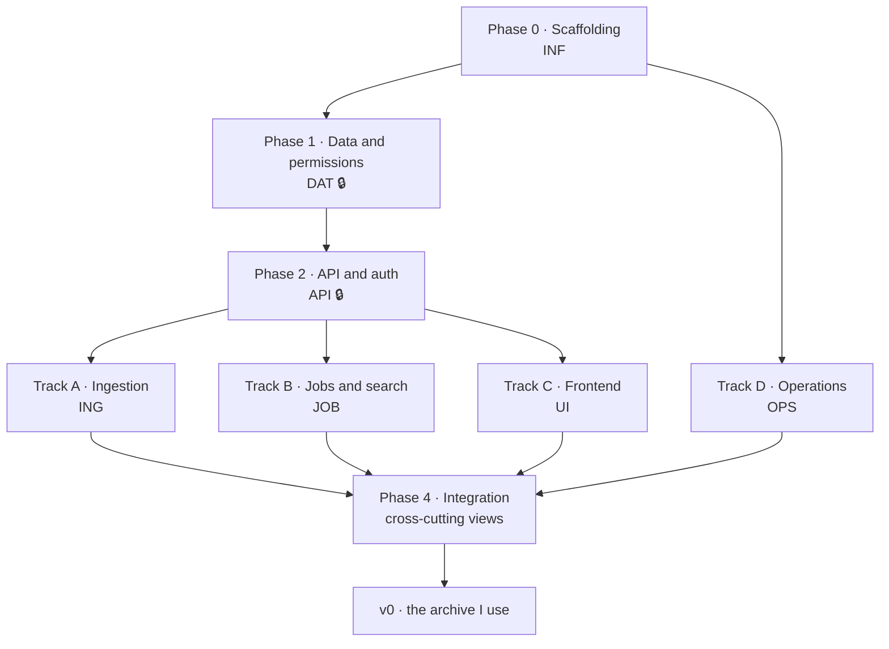

# v0 — the archive I use

The build plan for the **first version**, which has one job: to replace what I currently do with
my own audio. Publishing is not part of this milestone. What is scoped and waiting for a version to
claim it is in [`docs/next-plan/`](../next-plan/); what is wanted and not yet scoped is
[`ROADMAP.md`](../../ROADMAP.md).

This is the first of the per-version plans: the working set while the first version is being built,
and the record of what it contained once it ships. It keeps this name either way.

This page is the index. Every task lives in the file for its track, and this one carries what is
true across all of them: what the first version is for, the order the work was done in, and what
has to hold before it is finished.

### The utility threshold

> I can put audio in, it gets transcribed, and I find one specific moment by searching across
> everything I have.

Anything that does not serve that sentence directly is not v0. Chasing summaries and AI features
in the first version would mean competing on ground that is already lost.

### The rule that governs this milestone

**Do not offer an installable release until it has run against the real archive without
incident.** In this niche credibility comes exclusively from the author using the tool, and the
fastest way to destroy it is to ship something that loses files. The bar is **several weeks of
real personal use with nothing going wrong in them**, and with what went wrong before that fixed
rather than noted — not a date, and not a checklist that can be ticked while the archive in it is
a test fixture.

**The repository is a separate gate, and it opens when the tasks in this plan are closed.** It was
bundled with the release in `REL-5` to begin with; it was then taken out and opened ahead of the
release, on the reasoning that the code, the plan and the decisions behind them are worth reading
before there is anything to install. That is now reversed, and publication belongs to `REL-5`
again.

Two gates, then, and neither is a date: **the repository opens when every task here is closed**,
and **the release waits for several weeks of real use on top of that**. The argument for reading
the code early was never wrong in itself; what it left out is that the reader would arrive at a
plan whose open list was still long, and several of those tasks defects in work this plan calls
shipped. Opening on the day that list is empty costs a few weeks and means the first person
through the door is reading a finished thing.

Until then this is one person's working repository, and it says so in one place — here.

### What is cut, and what is not

The **data model stays whole** — rebuilding it later is far more expensive than carrying columns
nobody reads yet. Permission resolution stays exactly as specified, because it is cheap and it is
the foundation everything else stands on.

What is cut is surface: v0 ships with **local accounts only**, users created by hand by the
administrator, and **sharing at library level only**. Left out: OIDC, proxy-header authentication,
individual-recording sharing, ownership transfer (users with content simply cannot be deleted),
API tokens, MCP, manual transcript editing and LLM suggestions. Every one of those is a feature in
[`ROADMAP.md`](../../ROADMAP.md), which carries no identifiers: each gets a number on the day it is
cut into tasks.

---

## How to read this plan

Every task has a **stable identifier** (`DAT-3`, `UI-7`…) that can be referenced from commits,
branches and issues. The prefix indicates the **work track**, not the phase, and **the prefix is
the file**: `UI-7` is in `interface.md`, `DAT-3` is in `data.md`, with no exceptions to remember.
**Identifiers never get renumbered** — a task deferred to [`docs/next-plan/`](../next-plan/) keeps
the number it has here, which is why gaps in the numbering are expected and are not mistakes. A
task that turns out not to be scoped work at all becomes a feature in
[`ROADMAP.md`](../../ROADMAP.md) and gives its number up, which is only safe while nothing cites
it.

| Prefix | Track | What it covers | Where |
|---|---|---|---|
| `INF` | Repository infrastructure | Scaffolding, tooling, CI | [`infrastructure.md`](infrastructure.md) |
| `DEC` | Decisions | The points that blocked code, and what settled them | [`decisions.md`](decisions.md) |
| `DAT` | Data and permissions | Schema, migrations, ACL, access layer | [`data.md`](data.md) |
| `API` | API and authentication | HTTP skeleton, sessions | [`api.md`](api.md) |
| `ING` | Ingestion and playback | Storage, ffprobe, waveform, streaming, integrity | [`ingestion.md`](ingestion.md) |
| `JOB` | Jobs, transcription and search | Queue, providers, segments, FTS5 | [`jobs.md`](jobs.md) |
| `UI` | Frontend | Every view, and the system and spine beneath them | [`interface.md`](interface.md) |
| `OPS` | Operations | Docker, configuration, backup, observability | [`operations.md`](operations.md) |
| `INT` | Integration | Views that cross tracks: trash, administration, security | [`integration.md`](integration.md) |
| `TRX` | Transcription compatibility | What an engine has to look like for Sonarium to consume it | [`transcription.md`](transcription.md) |
| `SEC` | Pre-publication hardening | What was fixed before anybody could read the source | [`security.md`](security.md) |
| `BUG` | Defects found in use | Faults found by using the archive rather than by reading it | [`defects.md`](defects.md) |
| `REV` | Backend review | What a read of the finished backend found, and what settled each finding | [`review.md`](review.md) |

Notation:

- `⇢ X, Y` — **depends on**. Cannot start until `X` and `Y` are done.
- `🔒` — **critical path**: until it is done, entire tracks are stalled.
- `🧪` — carries a mandatory test before it can be called done.
- `❓` — depends on a decision that is still open. **Nothing here carries it any more**; every
  decision the first version needs is settled in [`decisions.md`](decisions.md).

A task is done when it meets the criterion written next to it, not when it "works".

The last four tracks were not planned in advance. `TRX`, `SEC`, `BUG` and `REV` are what came
back from building the thing, hardening it and reading it, and they are here for the same reason
the rest is: an identifier in a commit message or a comment has to resolve to something a reader
of this repository can open.

### Identifiers you will meet in the code that are not here

One track is planned in a working document that is **not in this repository**, and its identifiers
are cited from code and commit messages all the same:

| Prefix | Track | Why it is not here |
|---|---|---|
| `FBK` | Feedback and liveness: what the interface says while it works | A working document, kept local while the first version is built |

A comment citing `FBK-3` is pointing at a decision that was taken and is described where it was
applied, in the code itself. Nothing in this plan depends on that document.

[`review.md`](review.md) is the same shape from the other side: the findings and what settled
them are here, and the reading that produced them — severity, assessment, the measurements taken
at the time — is a working document too. A candid reading of your own code stops being candid
once it is a published artefact.

For the same reason the per-view field tables, state tables and copy are **not reproduced here**.
They live in the interface specification, which is a working document kept out of the repository
while the first version is built; this plan names what to build and points at the section that
says what it contains. The one exception is the **design system**, vendored at
[`frontend/design-system/`](../../frontend/design-system/README.md) because the application
consumes it directly. Everything needed to understand *what* a task is and *why* it exists is
here.

---

## Phase map

The tracks above are how the work is filed. The phases are the order it was done in, and the two
line up almost exactly: Phase 0 is `INF`, Phase 1 is `DAT`, Phase 2 is `API`, Phase 4 is `INT`,
and Phase 3 is four tracks running at once.

**How much parallelism there actually is**, by point in the project:

| Point | Work that can run in parallel… |
|---|---|
| Phase 0 | All of `INF` at once, and `OPS-1`/`OPS-2` can already be tackled |
| Phase 1 | Not much else: `DAT` is the bottleneck. In parallel: `UI-1`, `UI-2` (the design system and the waveform, against generated peaks), and `JOB-13`, which needs no schema |
| Phase 2 | `API` alongside `UI-3`/`UI-4` (client and shell against mocks) and `OPS` |
| Phase 3 | **Four full tracks at once**: `ING`, `JOB`, `UI`, `OPS` |
| Phase 4 | Everything converges; the cross-cutting tasks want two finished tracks |

---

## What is left

Every track has now been read against the code, so an unticked box is one somebody checked rather
than one nobody reached. None of them blocks another — the ordering this section used to carry is
spent along with the tasks in it. They fall into two groups, and the tables below are the count.

These are what the plan always held:

| Task | What is outstanding |
|---|---|
| `OPS-4` | The backend half is done and tested; the bundle has no base path, so the subpath arrangement serves a shell that cannot fetch itself |
| `OPS-6` | Both halves of its marker: a restore into a container, and an upgrade that crosses a revision rather than proving a no-op is a no-op |
| `ING-11` | The round trip — exit criterion 4 — and the four defects that would each break it before anybody got to run it |
| `ING-12` | Whether a derived date carries a time of day, rather than being presented as midnight |
| `ING-13` | The `fsck` command's own test, and the two file kinds its orphan scan cannot see |
| `INT-6` | Playwright over the utility threshold; nothing exists yet |
| `API-18` | The permission vocabulary on `GET /instance`, which nothing implements |
| `JOB-3` | A run against a real engine, rather than against the mocked transport the tests use |
| `REV-S6` | The comment voice, in [`review.md`](review.md) |

`INF-8` is spent rather than open and carries no box at all: the folder it asks for was decided
against when `REV-10` built [`review.md`](review.md), [`security.md`](security.md) and
[`defects.md`](defects.md) instead.

The rest came from reading the finished product rather than this plan, which is why most of them
are numbered children of the task that produced them:

| Task | What it is |
|---|---|
| `UI-4f1` | A phone has no way to reach the trash, so nothing deleted there can be restored |
| `UI-23a1` | The dialogs are audited by nothing, though the harness says otherwise |
| `UI-32b1` | The 44px exemption list has outgrown the account of it |
| `UI-33a1` | Raw type values returned in components written after the reconciliation |
| `INT-3b1` | Deleting an account that uploaded elsewhere meets a foreign key, not the refusal |
| `UI-39` | The web-app manifest: white in a dark product, and root-absolute under `OPS-4` |
| `INF-11` | A webfont is redistributed with no licence beside it, unlike the one next to it |

Three of the five conditions below are acts rather than tasks — performed against the real
archive, and not tickable anywhere.

---

## When is v0 done

Not when the checkboxes are ticked. When all of these hold:

1. **My real archive is in it** — imported, transcribed, searchable — and I have stopped using
   what I used before.
2. **A second real person uses it.** One family member, one shared library, actual usage on a
   phone. The retention layer is what justifies the entire multi-user architecture, and until
   somebody who did not build it uses it, that justification is theoretical and the permission
   model is validated only by its own tests.
3. **`ING-13` has run clean** against the real archive after at least one upgrade, and
   **`OPS-6`'s restore has been performed for real**, not just tested in CI.
4. **`ING-11`'s export round-trips**: export the whole archive, import it into an empty instance,
   and get the same thing back.
5. **Several weeks have passed** with all of the above true and nothing going wrong in them.

Only then does [`docs/next-plan/`](../next-plan/) begin — the repository opening, and then a
release.
